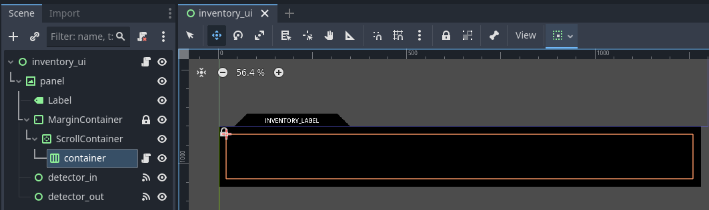
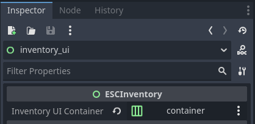

.. _create_inventory:

Creating an inventory
=====================

The inventory scene is responsible of displaying all items in the player's
inventory, allowing them to perform actions on them. These actions can be
simple (look, open, close...) or more complex, such as combining them with
another inventory item or also a room item.

Escoria allows you to setup and display the player inventory with great
flexibility. Therefore, you may build your inventory scene in freedom, define
the way it shows up and hides (possibly with an animation), etc.

Build the scene
---------------

You may construct the inventory scene so it looks exactly the way you want it.
In this matter, you may use all Godot nodes at your disposal to achieve your
goal freely. It can feature images, sprites, areas, controls that you can
script using GDScript at your needs.

For example, you may want to display your inventory at all time in a given area
of the screen, or define a clickable button to show it, or hot focus areas
waiting for the mouse pointer to trigger the inventory. If it is hidden by
default, you can either pop it on the screen, or define hide and show
animations. This is totally at your hand to be done fully with Godot features.

Escoria is designed to be no barrier - it only requires 2 specific nodes to be
present in the inventory scene tree. These 2 nodes are described in the section
below.

Necessary Escoria nodes
~~~~~~~~~~~~~~~~~~~~~~~

The inventory scene is a special Escoria scene that involves two nodes in
particular:

- ``ESCInventory``: this is the root node of the inventory scene. It inherits
  ``Control`` to allow user inputs (using mouse, keyword or game controller),
  and its role is mainly to act as a Facade to inventory, allowing the addition
  and removal of items in its defined container.

  .. note::

    Note: you may use your own custom script extending ``ESCInventory`` if you
    need to add more functions to this node.

- ``ESCInventoryContainer``: this is the container node that will display the
  items present in the inventory. This node has to be  manually created, as it
  needs to be any of Godot's ``Control/Container/*`` nodes (``HBoxContainer``,
  ``VBoxContainer``, ``GridContainer``...), and the
  ``res://addons/escoria-core/ui_library/inventory/esc_inventory_container.gd``
  script attached to it afterwards.

  .. note::

    Unfortunately Godot doesn't allow adding an ``ESCInventoryContainer`` node
    to the scene and changing its type to any of Godot ``Control/Container/*``
    while keeping its attached script. We will provide a simplified way to
    insert this node to your scene, asking you to choose its actual type.

This is an example of an inventory scene fully composed (part of the
simple-mouse plugin):

After the ``ESCInventoryContainer`` node is added to the scene, it needs to be
targeted by the ``ESCInventory`` node. To do so, select the ``ESCInventory``
node, then in the inspector, select the target ``ESCInventoryContainer`` as
Inventory UI parameter.

The scene can then be saved, either in a plugin or in a new ``res://*/``
folder, at your preference.

Inserting/Removing items to/from inventory
------------------------------------------

``ESCItem`` define usable and pickable items. You may select an inventory
texture in the Inspector, that will be used when the item is added to the
inventory.

Adding and removing an item to/from the inventory can be performed in two ways:

- in an ASHES script using ``inventory_add`` and ``inventory_remove``
  functions. Both functions take the ``global_id`` of the item as parameter.

- in GDScript, using the ``escoria.inventory_manager.add_item(item_id:
  String)`` and ``escoria.inventory_manager.remove_item(item_id: String)``
  functions.

Creating inventory item scenes
------------------------------

An inventory item is an ``ESCItem`` scene that Escoria can load from the
configured inventory items path. In the default project template, that path is
``res://game/items/inventory``.

For each inventory item:

- Create a new scene with ``ESCItem`` as the root node.
- Set a unique ``Global ID``. This is the id used by ASHES commands such as
  ``inventory_add("r5_pen")`` and by targeted events such as
  ``:use "r5_empty_sheet"``.
- Add a visible child node, often a ``Sprite2D``.
- Add a ``CollisionShape2D`` or ``CollisionPolygon2D`` so the item can receive
  mouse input when it appears in a room.
- Create an ASHES script for the item and assign it to the ``Esc Script``
  property.
- Set ``Inventory Texture`` if the item should use a different image in the
  inventory UI than it uses in the room.

A simple item that can be picked up from a room might have this event in its
ASHES script:

.. code-block::

  :pickup

    inventory_add("r5_pen")
    set_active("r5_pen", false)

After this event runs, the room object is hidden and the inventory manager adds
the item with global id ``r5_pen`` to the player's inventory.

Normal inventory actions
------------------------

If an inventory item can be inspected or used by itself, define a normal
event in that item's ASHES script:

.. code-block::

  :look

    say("player", "A fountain pen. Still full of ink.")

  :use

    say("player", "I need something to write on.")

The ``Default Action Inventory`` property controls which *verb* Escoria should
use when the player clicks the item in the inventory. For example, if the pen's
``Default Action Inventory`` is ``use``, clicking the pen in the inventory uses
the ``use`` action.

This does not automatically make Escoria wait for another object should the
item require another object to perform the desired action.. If the action
should use a second clicked object, configure the item as described below.

Targeted inventory interactions
-------------------------------

Some inventory actions need two objects: a **source item** and a **target
object**.

Examples include:

- use pen on paper
- use key on door
- give letter to character
- use wrench on machine

For these interactions, set the source item's
``Actions Requiring Target Object`` property. List the action verbs that should
make this item wait for a second clicked target object.

For example, if the inventory item ``r5_pen`` has this value:

.. code-block:: gdscript

  actions_requiring_target_object = PackedStringArray("use")

then selecting ``use`` on the pen does not immediately run plain ``:use``.
Escoria treats the pen as the current source item, waits for the player to
click another object, and then looks for a targeted event.

.. hint::

  You can set the property directly in the Godot editor, as well!

The targeted event can be written on the source item's script:

.. code-block::

  :use "r5_empty_sheet"

    say("player", "Ok, let's write something down.")

In this example, the pen is the selected source item and ``r5_empty_sheet`` is
the second clicked target object.

The same pattern works with other verbs:

.. code-block::

  :give "r2_guard"

    say("player", "Here's the letter from the mayor.")

For this ``give`` example, the letter item should include ``give`` in
``Actions Requiring Target Object``.

.. important::

  ``Actions Requiring Target Object`` is separate from
  ``Default Action Inventory``. If ``Default Action Inventory`` is ``use`` and
  the item needs a second object, ``use`` must also be listed in
  ``Actions Requiring Target Object``. Otherwise Escoria treats the click as a
  normal one-object action and looks for plain ``:use`` instead of a targeted
  event such as ``:use "r5_empty_sheet"``.

Reverse targeted events and one-way combinations
~~~~~~~~~~~~~~~~~~~~~~~~~~~~~~~~~~~~~~~~~~~~~~~~

Escoria can also try the reverse direction for targeted interactions. For
example, if the source item does not define ``:use "target_id"``, Escoria may
check whether the target object's script defines ``:use "source_id"``.

This is useful when it reads more naturally to keep the event on the room
object:

.. code-block::

  # door.esc

  :use "r1_key"

    say("player", "The key fits.")
    set_global("door_unlocked", true)

If the interaction should only work in the direction written in ASHES, enable
``Combine Is One Way`` on the relevant item. This prevents Escoria from trying
the reverse lookup for that targeted action.

Troubleshooting targeted actions
~~~~~~~~~~~~~~~~~~~~~~~~~~~~~~~~

If Escoria reports an invalid action or missing event even though you wrote a
targeted event such as:

.. code-block::

  :use "r5_wrench"

check the source inventory item. The action verb must be present in
``Actions Requiring Target Object``. Without that setting, Escoria does not
enter the targeted-action flow and will look for a normal one-object ``:use``
event instead.

Useful ESCItem properties for inventory items
---------------------------------------------

These ``ESCItem`` properties are especially relevant when building inventory
objects:

``Global ID``
  The stable id used by ASHES scripts, inventory commands, save data, and
  targeted events.

``Esc Script``
  The ASHES script that defines the item's events, such as ``:look``, ``:use``,
  ``:pickup``, or ``:use "other_object"``.

``Default Action``
  The action used when the item is clicked in a room and the UI chooses a
  default verb.

``Default Action Inventory``
  The action used when the item is clicked in the inventory and the UI chooses
  a default verb.

``Actions Requiring Target Object``
  The list of verbs that should make this item become the source/tool object
  and wait for a second clicked target object.

``Combine Is One Way``
  Controls whether targeted interactions must be written in the same source to
  target direction that the player used, or whether Escoria may also try the
  reverse direction.

``Use From Inventory Only``
  Requires the item to be in the player's inventory before the configured
  action can be used. This is useful for carried tools and objects, but should
  usually stay disabled for room objects such as buttons or scenery.

``Inventory Texture`` and ``Inventory Texture Hovered``
  The item's normal and hovered images in the inventory UI. These can be
  different from the sprite used when the item appears in a room.

``Tooltip Name``
  The text shown by tooltip UIs when the item is hovered.

``Is Interactive``
  Controls whether the player can interact with the item. Disable it for
  objects that should temporarily ignore input.

``Hover Enabled``, ``Hover Modulate``, ``Hover Texture`` and ``Hover Shader``
  Built-in hover feedback options for changing the item's appearance while the
  pointer is over it.

``Player Orients On Arrival`` and ``Interaction Angle``
  Control whether the player turns to a specific angle after walking to the
  item. This is useful for room objects that should be approached from a
  particular side.

``Is Exit``
  Lets an ``ESCItem`` behave as a scripted exit by running an ``:exit_scene``
  event. Use this when leaving a room requires dialogue, checks, or a cutscene.

``Is Trigger``, ``Trigger In Verb`` and ``Trigger Out Verb``
  Let an item act as an area trigger that runs events when other items enter or
  leave its collision area.
