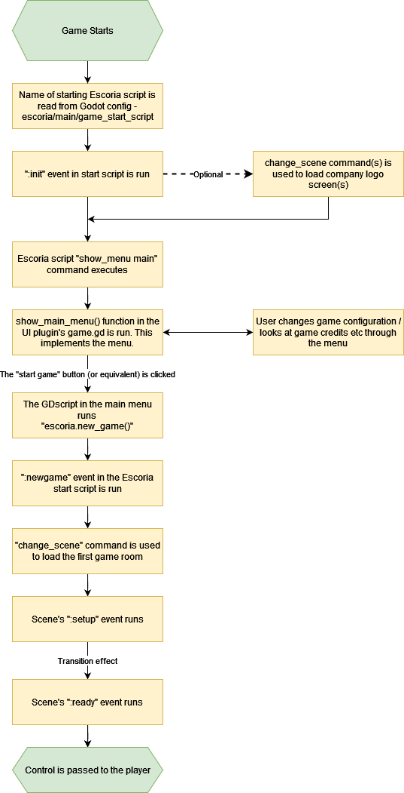

.. _architecture_of_escoria:

Architecture of Escoria
=======================

The plugin script, autoload and classes
---------------------------------------

According to the `concept of Godot plugins`_,
Escoria initializes itself in the plugin script
:doc:`addons/escoria-core/plugin.gd <../api/plugin.gd>`. This script is
mostly used to initialize the :ref:`Escoria configuration items
<escoria_settings>` and initialize (and later remove) the autoload scene
:doc:`escoria <../api/escoria.gd>`.

This scene binds together all required objects and interfaces in a central
place.

In addition to this, various classes are defined in their respective class
files which build up the various resources used in Escoria. See the
:doc:`API-docs section <../api/main.gd>` for details.

Nodes and objects of the Escoria autoload scene
-----------------------------------------------

The :doc:`Escoria autoload scene <../api/escoria.gd>` holds various nodes
that provide vital parts of the engine.

Logger
~~~~~~

The :doc:`ESC logging framework <../api/ESCLogger>` is responsible for logging
various game events throughout the engine.

Utils
~~~~~

Some smaller :doc:`utilities <../api/ESCUtils>` used in various places in
the engine.

Inventory manager
~~~~~~~~~~~~~~~~~

The :doc:`inventory manager <../api/ESCInventoryManager>` is responsible for
storing inventory items the player carries around.

Action Manager
~~~~~~~~~~~~~~

The :doc:`action manager <../api/ESCActionManager>` is used when the player
triggers a verb or uses items.

ESC Compiler
~~~~~~~~~~~~

The :doc:`ESC compiler <../api/ESCCompiler>` compiles files in the :ref:`ESC
language <_esc_language_reference>` into a list of events that can
be run by the :doc:`ESC event manager <../api/ESCEventManager>`.

Event manager
~~~~~~~~~~~~~

The :doc:`ESC event manager <../api/ESCEventManager>` is used for queueing
and scheduling events and handles event execution.

Globals manager
~~~~~~~~~~~~~~~

The :doc:`globals manager <../api/ESCGlobalsManager>` stores and handles
global flags as described in the :ref:`ESC reference
<_esc_language_reference#global_flags>`.

Object manager
~~~~~~~~~~~~~~

The :doc:`object manager <../api/ESCObjectManager>` handles the state of the
objects used in the game (active/interactive/states). All objects that should
be handled by the engine - especially by ESC scripts - are required to register
with the object manager and have a unique global ID.

Command registry
~~~~~~~~~~~~~~~~

The :doc:`command registry <../api/ESCCommandRegistry>` stores references to
available ESC commands. By adding additional command directories via the
settings, developers can enrich the ESC language for their specific needs.

Resource cache
~~~~~~~~~~~~~~

To optimize performance on platforms that support a larger memory footprint,
resources can be cached in the :doc:`resource cache
<../api/ESCResourceCache>` using the :ref:`queue_resource
<_esc_language_reference#queue_resource>` ESC command.

Dialog player
~~~~~~~~~~~~~

The :doc:`dialog player <../api/ESCDialogsPlayer>` is used for handling
dialogs and the :ref:`say <_esc_language_reference#say>` command.

Main
~~~~

:doc:`escoria.main <../api/main.gd>` is the main scene manager used in
Escoria that allows for switching scenes with transitions

Inputs Manager
~~~~~~~~~~~~~~

The :doc:`inputs manager <../api/ESCInputsManager>` is the central
component in Escoria to receive, handle, and deliver input events.

Save manager
~~~~~~~~~~~~

The :doc:`save manager <../api/ESCSaveManager>` is responsible for
storing and loading savegames as well as the game settings.

The Godot main scene of Escoria
-------------------------------

The scene that Godot loads when starting a game (the `main scene`_)
is set to :doc:`addons/escoria-core/game/main_scene.tscn
<../api/main_scene.gd>` which basically instantiates the configured main menu
scene and starts it.

The interactivity workflow of Escoria
-------------------------------------

When the player clicks on an :doc:`ESCItem <../api/ESCItem>`, the input
manager is used to check and distribute the click to the currently running game
interface. The game interface is then responsible for taking the respective
action based on its workflow. This way, different user interfaces can be
implemented. For a coin interface, for example, a right click could open the
coin and let the player select the respective verb.

The game interface will ultimately call ``escoria.do``, a plumbing that handles
core functions like walking, clicking on items, and visiting areas. This method
will then take care of the different actions; for example, moving the player to
an object (or its ``interact_position``) and then running the appropriate
event. The event is based on the ``current_action`` set in the
:doc:`actions manager <../api/ESCActionManager>` (the verb) and the
``current_tool`` (the selected item). If the current verb is ``use`` and the
ESC script has an event ``:use``, the
:doc:`event manager <../api/ESCEventManager>` will run that specific event.

.. _`concept of Godot plugins`: https://docs.godotengine.org/en/stable/tutorials/plugins/editor/making_plugins.html
.. _`main scene`: https://docs.godotengine.org/en/stable/getting_started/step_by_step/exporting.html#setting-a-main-scene

Game start sequence
-------------------

This is an overview of the steps that happen between when the player runs
your game on their computer to when they can start playing it.

