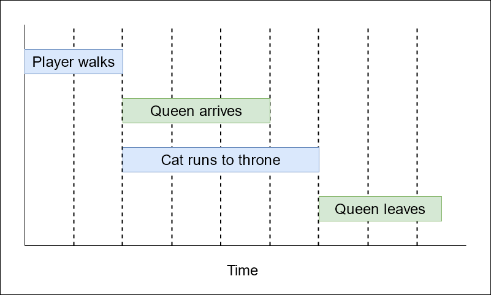
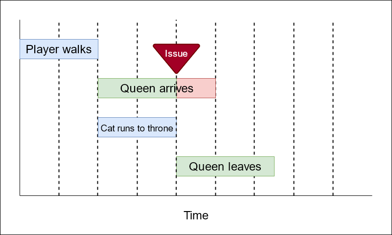
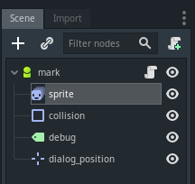
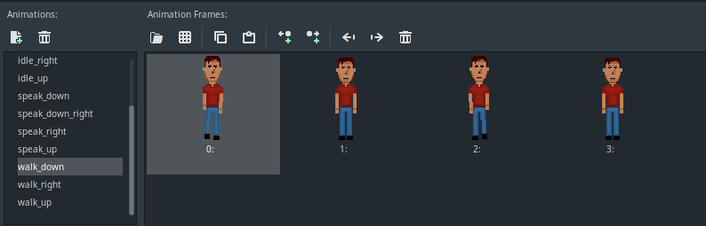
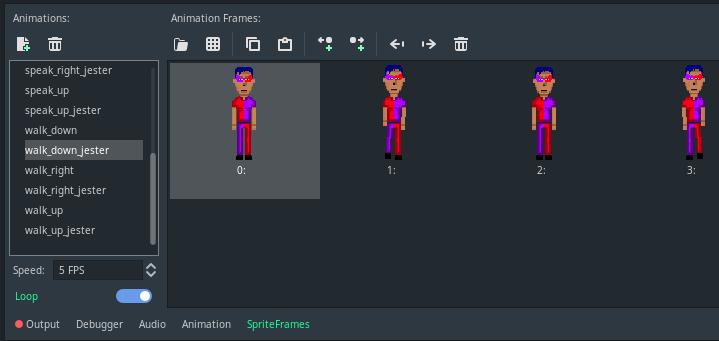
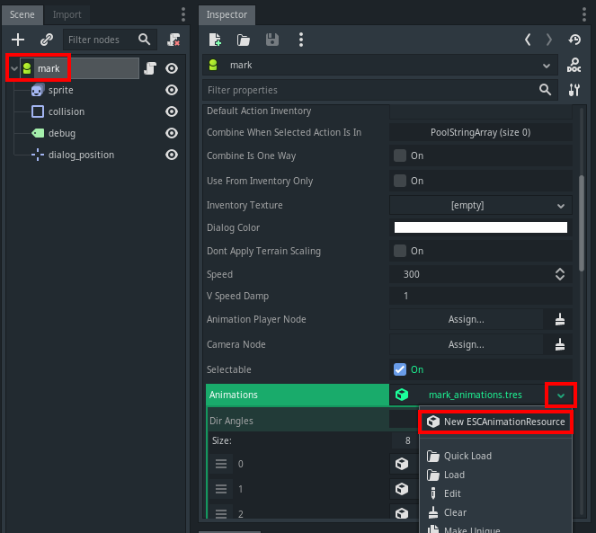
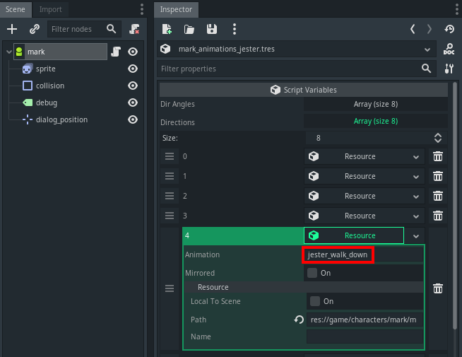

.. _faq:

FAQ
===

How do I specify the first game room?
-------------------------------------

An ESC script is used to tell Escoria which room to open as your game's
first "room". The script is configured in Godot's settings under "Escoria/Game
Start Script"

.. image:: img/logo_game_start_script.png
   :alt: Start script configuration location

This script needs to contain two events:

* ":init" - this event will run as soon as Escoria has been
  initialised.   Place any commands to display company logos or short opening
  cutscenes here (see :ref:`logo-label`).
  Alternatively, use ``:init`` to just display your game's main menu.

.. code-block::

   :init
   # Show main menu immediately without a company logo screen
   show_menu main

* ":newgame" - this event will run when the player selects "Start New Game"
  on your game's menu. This needs to include a ``change_scene`` call to
  open your game's first room.

.. code-block::

   :newgame
   change_scene res://game/rooms/startroom/startroom.tscn

How do I implement puzzles?
---------------------------

Puzzles can be broken down into two broad areas.

- Escoria script puzzles

Escoria script puzzles are ones that can be completely made using Escoria
script. Demo room 9 provides an example of this. Through the use of inventory
items and game variables, puzzles can be progressed and their status
determined.

An example of this is getting past a door bodyguard with a pass phrase.
In the game, when the character "looks at" a note on a computer that reads
"the password is abc123", Escoria script can be used to set a
"password_obtained" variable to true. When the character later talks to the
bodyguard, the script logic can check whether "password_obtained" is set to
true and based on that provide new dialog options, or run an animation to
move the bodyguard away from the door.

- GDscript based puzzles

In the event you wanted to include a puzzle that requires more complexity than
Escoria script can provide, you can use native GDscript to implement this.
Demo room 8 provides an example of this. The "spawn" Escoria script is used to
spawn the GDScript scene that contains your puzzle (arcade puzzle etc).
Example:

.. code-block:: gdscript

    spawn puzzle "res://game/rooms/room08/puzzle/10_buttons_puzzle.tscn"

Your Godot scene can contain anything you like - you're
only limited by Godot's limitations and your imagination. The main requirements
of your Godot scene are :

- In your ready script, you need to hide Escoria

.. code-block:: gdscript

    escoria.main.current_scene.game.hide_ui()
    escoria.main.current_scene.hide()

- As a result of what happens as the player progresses the puzzle, you can pass
  state back to Escoria via Escoria's global variables, run an
  animation to change the look of the room post-puzzle, and deactivate /
  activate objects in your room as a result of the puzzle's success/failure.

.. code-block:: gdscript

    # set a global
    escoria.globals_manager.set_global("r8_m_door_open", true)

    # Run an animation to change what the player sees in the room
    escoria.object_manager.get_object("r8_m_door").set_state("door_open")

    # Make the puzzle no longer available to use as the player completed it
    escoria.object_manager.get_object("r8_mini_puzzle_button").active = false

- When the player quits / completes / fails the puzzle, you need to return
  control back to escoria, then delete the puzzle scene using the
  "queue_free()" command.

.. code-block:: gdscript

    escoria.main.current_scene.game.show_ui()
    escoria.main.current_scene.show()
    queue_free()

What's the difference between states and animations?
----------------------------------------------------

The features offered by the state and animation commands are rather similar.
This documentation section is to help you choose when to use a particular
command.

``anim`` is used for starting an animation and immediately returning control
to the next command in the script. This is good for animations that will run
once (like part of a cutscene), allowing you to have furher script commands
running while the animation is executing. As an example, you could start an
animation of a bird flying across the screen, then a separate one of a car
driving along - both animations would run simultaneously.

``anim_block`` is used when you want to control the pacing of your game /
cutscene, and ensure that an animation completes before further game commands
are processed. As an example, if you had separate animations of someone walking
up to a door and another showing them opening it, using ``anim_block`` to play
the person walking animation would ensure they reached the door before
it was opened.

``set_state`` is like combining a "set global" command with an "anim" command.
It retains a state which can be queried (e.g. checking if the door is in an
unlocked or a locked state) and runs an animation (if an animation with the
same name exists in this room). State is preserved between rooms, meaning that
if you set door 2's state to "dooropen" and leave the room, when you come back,
if you query the state of door 2, it will still return "dooropen".

** Comment required here about whether state will play with "immediate" or not
when you reenter a room - still under discussion

** Comment required here once ESC script supports querying the current state
of an ESCItem

How do I create a cutscene?
---------------------------

A cutscene is a non-interactive part of the game where the player will watch
part of the story unfold. This could be short, like seeing a sunrise through
the bedroom window before you're allowed to make the player wake up and move
around, or long, telling the whole backstory of the game and its characters.

In Escoria, the cutscene is created through Escoria script and just requires
a series of commands to show graphics or animate sprites in your
game world.

You can start your cutscene when your room appears by placing the commands
as part of the `:ready` event.
:doc:`https://docs.escoria-framework.org/en/devel/scripting/z_esc_reference.html#ready-label`

Alternatively, you can start your cutscene when the player walks through a
trigger area or interacts with an object. For example, this script is attached
to a "button" in the scene, and runs a cutscene when the button is "pushed".

.. code-block::

  :push
  accept_input NONE

Blocking
~~~~~~~~

Escoria script commands fit into 2 main categories: blocking and non-blocking.
Using commands of the correct type is essential to your cutscene running the
way you expect it to. You can mix blocking and non-blocking commands.

Blocking commands have to complete entirely before the next command in the
script is executed. Non-blocking commands are commands that are started
and control is passed immediately to the next command in the script.
Non-blocking scripts allow for commands to run in parallel.

.. hint::

  Though blocking commands generally have "_block" as part of their names,
  some commands that don't (like `wait`) will also block. See the command
  reference to confirm if the command you want to use is blocking or not.
  :doc:https://docs.escoria-framework.org/en/devel/scripting/z_esc_reference.html

In this first example
* The player will walk to location (100,100)
* Once they arrive, the "queen_arrives" animation will start.
* As the "queen_arrives" animation is started with the non-blocking `anim`
command, the "cat_runs_to_throne" animation will also start at the same
time.
* Once the blocking "cat_runs_to_throne" animation has completed, the
"queen_leaves" animation will run.

.. code-block::

  walk_to_pos_block player 100 100
  anim queen queen_arrives
  anim_block cat cat_runs_to_throne
  anim queen queen_leaves

.. hint::

  Be wary of the lengths of animations when mixing blocking and non-blocking
  commands. In the above example, if the "queen_arrives" animation
  takes more time to complete than the "cat_runs_to_throne" animation, the
  cutscene will not work as expected. The "queen_leaves" animation will
  commence as soon as the cat animation completes
  (i.e while the "queen_arrives" animation is still playing).

The `accept_input` command
~~~~~~~~~~~~~~~~~~~~~~~~~~

Another important command for creating cutscenes is the
:doc:`https://docs.escoria-framework.org/en/devel/scripting/z_esc_reference.html#accept-input-type-api-doc`
command. It's important that the player can't walk away or
interact with items while the story component of your game is running. For this
reason, Escoria provides you the `accept_input` command to limit the actions
the player can perform in your game. Generally you would want to disable
input at the start of a cutscene, and re-enable it on completion so the player
can keep playing your game.

.. code-block::

  accept_input NONE
  walk_to_pos_block player 100 100
  anim queen queen_arrives
  anim_block cat cat_runs_to_throne
  anim queen queen_leaves
  accept_input ALL

.. _logo-label:

How do I add a company logo or introductory cutscene?
-----------------------------------------------------

A company logo or introductory cutscene that plays before the menu of your
game is displayed is optional for your game. To create one:

* Create an ``ESCRoom`` to display your logo or cutscene introduction.
  Depending on your requirements this may be any combination of ESC
  commands and animations driven by Godot ``AnimationPlayers``.

* Create an ESC script and attach it
  to the ``ESCRoom``. Put the commands in here to display your
  game logo / opening scene (remembering to use the "| NO_UI" flags so your
  game's user interface is not displayed over the top of it).
  As this animation will play every time someone starts your
  game it is recommended to keep this scene to a few seconds in length. An
  example script for an introductory logo scene driven entirely by an
  animation is:

.. code-block::

   # Example introductory logo script
   :setup | NO_UI
   # Play the reset animation to make sure everythings as we expect it to be
   anim_block intro_animation_player RESET

   :ready | NO_UI
   # Play the "intro" animation
   anim_block intro_animation_player intro

   show_menu main

* Ensure at the end of your logo / cutscene that you have the
  ``show_menu main`` call to pass control back to the menu.

* Identify the main script that starts your game. This can be found in Godot's
  settings under "Escoria/Game Start Script"

.. image:: img/logo_game_start_script.png
   :alt: Start script configuration location

* Modify your start script so that it runs your intro scene as part of the
  ``:init`` event. It should also have a ":newgame" event to define which
  room should be loaded when a player starts a new game.

.. code-block::

   :init
   # Play Escoria logo cutscene
   change_scene res://game/rooms/logo/logo.tscn

   # Showing main menu
   show_menu main

   :newgame
   change_scene res://game/rooms/startroom/startroom.tscn

How do I change the characters costume?
---------------------------------------

There are two ways to change the look of a character. The first is to create
an entirely new character (i.e. a new Godot Scene with an `ESCPlayer` node,
animated sprite, collision area, etc). The second option is to change just the
animations (i.e. the sprites used) for the character.

Changing the entire player scene
~~~~~~~~~~~~~~~~~~~~~~~~~~~~~~~~

This option might be appropriate if you need to change something fundamental
about a character for a particular scene (e.g. if for a specific level you only
want the character to be able to walk in 2 directions where they normally have
8 directions defined). If you choose this option, create the character scene,
then in your game room (`ESCRoom`) set the `Player Scene` parameter to point at
the new character scene.

Changing the character animations
~~~~~~~~~~~~~~~~~~~~~~~~~~~~~~~~~

Changing the sprite set of a character so they look different (adding a hat,
glasses, or changing their clothes, for example) is an easy task. The process
involves creating new animations, then telling Escoria to change the character
to use the animations as its default at the appropriate time.

Create new animations
^^^^^^^^^^^^^^^^^^^^^

You should already have idle, talk, and walk animations defined for your
character. Open your character's animated sprite.

Looking at the Animations window you should see the SpriteFrames defined.

Create new animations matching your new spriteset and call them something
appropriate. In this example, the demonstration character has had some
jester clothes put on.

Go back to your character (`ESCPlayer`) node and, using the dropdown arrow on
the Animations parameter, select the menu option to create a new
**ESCAnimationResource**.

As when you created your player originally, set up the correct number of
directions for the character with the associated direction angles, as well as
the direction, idles and speak animations pointing at your newly created
animations.

Use the dropdown again, choosing the **save** option. Give the file
an appropriate name and location in the file dialog window that appears.

Assign the new animations to the character
^^^^^^^^^^^^^^^^^^^^^^^^^^^^^^^^^^^^^^^^^^

Now that you have the animations defined, you need to tell Escoria when you
want to use them. If the player buys a Jester outfit, for example, you may
script the "use" option for the Jester outfit inventory item to change the
animation set. The command used is "set_animations", and you pass it the
path to your **ESCAnimationResource** file.

inventory_jester_outfit.esc::
  :use

  set_animations player res://game/characters/mark/mark_animations_jester.tres

How do I add audio speech to my game?
-------------------------------------

See :doc:`https://docs.escoria-framework.org/en/devel/getting_started/dialogs.html#recorded-speech`

How do I translate my game into other languages?
------------------------------------------------

See :doc:`https://docs.escoria-framework.org/en/devel/getting_started/dialogs.html#translations`

How do I add a score to my game ?
---------------------------------

* In your initial game room's setup script, create a score global variable
  and set it to 0.
* When you pick up an `ESCItem` or interact with an NPC in some way that would
  score points, add or subtract from the score variable by using the
  `inc_global` and `dec_global` commands.
* How you display the score will be dependent on the user interface
* As the score is a global variable, it will save and load without any extra
  work as part of Escoria's save/load process.

Can you show me a basic room script?
------------------------------------

A suggested template for a room script looks like this (using a library
as an example)

.. code-block::

   :setup
   # Check if the player has ever been in this room
   # If not, do first-time setup
   > [!room_library_visited]
      # Here you'd have some steps to play a cutscene
      # e.g the librarian entering the room and sitting at the desk
      <...>
      # Set any room specific state. e.g. set a "conversation with librarian
      # not started" variable so she'll introduce herself when you talk to her

      # Make sure the room setup steps don't rerun if the player leaves the
      # room and comes back in
      set_global room_library_visited true

   # Position the player depending which room they've entered this one from
   teleport player door1 [eq ESC_LAST_SCENE room_street_outside_library]
   teleport player door2 [eq ESC_LAST_SCENE room_library_upstairs]

Why isn't my mouse working properly with my ESCItems?
-----------------------------------------------------

If you use a control node like ``TextureRect`` or ``ColorRect``,
they will cause problems with mouse interactions. You will need to
modify the properties of the ``TextureRect`` / ``ColorRect`` and set its
"Mouse Filter" setting to "Ignore".

How can I call my own GDScript function from Escoria?
-----------------------------------------------------

Escoria script makes this possible by providing the `custom` command. The
function must be associated with the child node of an `ESCItem` in your scene.

(See :doc:`https://docs.escoria-framework.org/en/devel/scripting/z_esc_reference.html#custom-object-node-func-name-params-api-doc`)

To make use of this handy command, follow these steps:

* Create a new node of an appropriate type as a child of an `ESCItem` in your
  scene. For example, if you have a door in your scene and you want to make a
  function that does something special when the door opens, you could create a
  child node of type `Node2D` underneath the `ESCItem` that represents the
  door.

.. hint::

   Remember the global ID and name of this `ESCItem`.
   You'll need them when you use the `custom` command.

* Create your GDScript function in a .gd file and attach it to the child node
  as described above. This function can be called anything you want, but it
  **must** take exactly one argument. Escoria will pass in to the function any
  and all arguments specified in the `custom` command as an array. If your
  function   doesn't require any arguments, Escoria will pass in an empty
  array.

.. hint::

  It is up to you to unpack the arguments passed in via the `custom` command as
  well as to perform any validation on these arguments you deem necessary.

* In the appropriate event in an Escoria script file, call the function you
  made above by using the `custom` command. For example :

   * Your game has a node with a global_id of "treasure_maps"
   * The "treasure_maps" node a child node called "france_treasure_map".
   * "france_treasure_map" has a Godot script (in GDscript format) attached.
      In this script is a function "draw_treasure" to show a map on the screen.
      In your Escoria script, you would call the script using :

.. code-block::

   :setup
   # Call the function you defined with some arguments
   # Format : custom esc_item_global_id child_node_name function_name arg1 arg2 ...
   # Note no parameters are passed to the "draw_treasure" function
   custom treasure_maps france_treasure_map draw_treasure

     * The GDScript it calls might look like this :

.. code-block::

   extends Node2D

   # An empty array is passed as a parameter to the function so we ignore it
   func draw_treasure(_ignored_parameter):
   get_node("../france_map_sprite").visible = true

* If instead you wanted to pass this script some parameters:

   * If your script took an x and y coordinate to display an "X marks the spot"
      graphic on the treasure map, your Escoria script code might look like :

.. code-block::

   :setup
   custom treasure_maps france_treasure_map draw_treasure {xcoordinate} {ycoordinate}

.. hint::

   Escoria variables (ESC flags, globals, etc) can be passed as
   parameters by wrapping them in braces.
   e.g. {xcoorinate}

   * The matching GDScript code now needs to extract those coordinates from the
      parameter array that is passed to the function.

.. code-block::

   extends Node2D

   # Extract coordinates from the array of parameters
   func draw_treasure(list_of_parameters):
        var xcoord = list_of_parameters[0]
        var ycoord = list_of_parameters[1]
        get_node("../france_map_sprite").visible = true
        [...]

.. hint::

   You can pass in as many arguments you want to your function. If no arguments
   are required, you don't need to specify anything else after the function's
   name.

.. hint::

   Any arguments you pass to your function must be literals.
   Escoria variables (ESC flags, globals, etc) cannot be passed currently.

