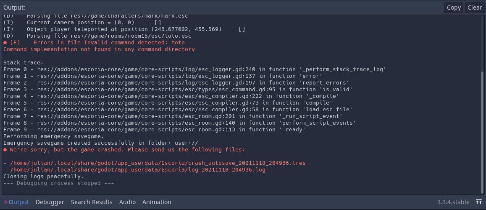
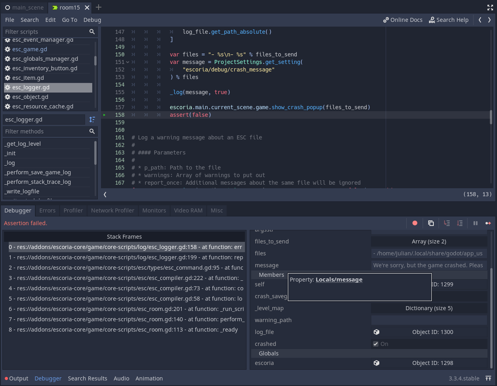

.. _how_to_debug:

How to debug
============

Console and debugger
--------------------

When games made with Escoria need testing, some errors and warnings may appear
in the console. This information can be very useful when debugging issues.

If Escoria encounters an error or a crash, it will stop the execution of the
game and return to the editor, showing you the line that broke. Usually, this
line will be located in Escoria's logger class, as this class is in charge of
showing the errors before stopping execution.

Godot also shows the debugger panel but it is advised to check the output log
first.

The console shows many lines, the verbosity of which depends on the log level
defined in **Project Settings**. In order from finest- to highest-level:

* **TRACE**
* **DEBUG**
* **INFO**
* **WARNING**
* **ERROR**

(The default logging level for Escoria is **ERROR**.)

In the example above, the error is explained in the line starting with ``(E)``
("E" for "Error", "D" for "Debug", "I" for "Info", "T" for "Trace"). The reason
for this error is that Escoria attempted to load a non-existant file. The
(E)rror line provides the path to the file that was expected. At this point,
fixing the issue is easy: Either create the missing file or remove any
references to this non-existant file in the scenes that use it.

This example is straightforward, of course. Sometimes, the issue can be
trickier. In this next case, the Debugger panel will be of use.

We will not cover the use of the debugger panel in this documentation
(information can be found on the official `Debugger panel documentation
page`_). The Stack Frames can be used to go back to the line that initiated the
crash.

Escoria data
------------

Finding the current state of the data held by Escoria during the execution of
the game or at the moment of a crash is often necessary. These data can be
easily accessed which can be helpful in understanding why the game is not
behaving the way it is supposed to.

Find current Escoria data during the game execution
~~~~~~~~~~~~~~~~~~~~~~~~~~~~~~~~~~~~~~~~~~~~~~~~~~~

While the game is running, switch to the Godot Engine editor. In the "Scene"
tab, the "Remote" button reveals the actual state of the scene tree in the game
currently being executed. The ``escoria`` object is located under the root
node where it can be selected.

.. image:: img/remote-scene-tree.png
    :align: center
    :alt: Crash error: escoria object in debugger panel

Find current Escoria data when a crash occurs
~~~~~~~~~~~~~~~~~~~~~~~~~~~~~~~~~~~~~~~~~~~~~

In case of a crash, the ``escoria`` object can easily be accessed in the
bottom-right corner of the debugger panel by clicking the ``escoria`` variable
in the "Globals" section (framed in yellow in the following screenshot):

Access managers from the Escoria object
~~~~~~~~~~~~~~~~~~~~~~~~~~~~~~~~~~~~~~~

When the ``escoria`` object is selected in the Remote scene tree or in the
debugger panel, its contents are displayed in the Inspector:

.. image:: img/crash-escoria-inspector.png
    :align: center
    :alt: Crash error: Escoria object in inspector

Each manager object can be accessed by clicking the "Object ID" button next to
its label. As an example, here is the result for the **Objects Manager**:

.. image:: img/crash-objects-manager-inspector.png
    :align: center
    :alt: Crash error: Objects Manager in inspector

From there, every object can be accessed and checked. Same for the **Globals
Manager**:

.. image:: img/crash-globals-manager-inspector.png
    :align: center
    :alt: Crash error: Globals Manager in inspector

.. _Debugger panel documentation page: https://docs.godotengine.org/en/stable/tutorials/debug/debugger_panel.html

Escoria game crash management
-----------------------------

Escoria comes with auto logfile and emergency savegame generation when a crash
occurs. When that happens, it is notified in the console and in a crash popup.

As soon as the crash popup is closed, the game will terminate.

Hide or define a custom crash popup
~~~~~~~~~~~~~~~~~~~~~~~~~~~~~~~~~~~

By default, Escoria displays a simple ``AcceptDialog`` with the content of
Project Settings' ``escoria/debug/crash_message`` variable as shown above. It
is automatically filled with the generated log and savegame paths.

If displaying the popup is not desired, it is then required to override the
show_crash_popup() function in the game script. For the popup not to show, this
function simply needs ``pass``.

If however a specifially themed popup needs to be displayed, then it can be
created in its own scene. The overriden ``show_crash_popup()`` function can
then instance it and add it as child to the game scene. The text of the popup
needs to be manually constructed using Project Settings'
``escoria/debug/crash_message`` variable and the ``files: Array`` parameter of
the function that contains paths to all generated files when the crash
happened.

Whatever the way this function is implemented, it needs to finally emit the
signal ``crash_popup_confirmed`` when it closes: this signal is connected to an
internal function that terminates the game.
