Create an Escoria project
=========================

Escoria's main design is centred around its core addon which supports the
developer with functionality and features to make developing adventure games
as easy and streamlined as possible.

At the same time, Escoria aims to give a lot of freedom to the developer with
regard to the design of the game and its interface.

Because of this, neither a specific user interface nor a dialog manager are
included in the Escoria core, although either may be installed as
additional addons from the Godot Asset Library or completely made from scratch
for the specific game you're making.

To make starting with Escoria as easy as possible, we provide a Godot Game
Template along with stock user interfaces and dialog managers to get you up and
running in no time.

Starting a new Escoria project
------------------------------

Open the Godot project manager, switch to the **Templates** tab, and search for
the Escoria game template:

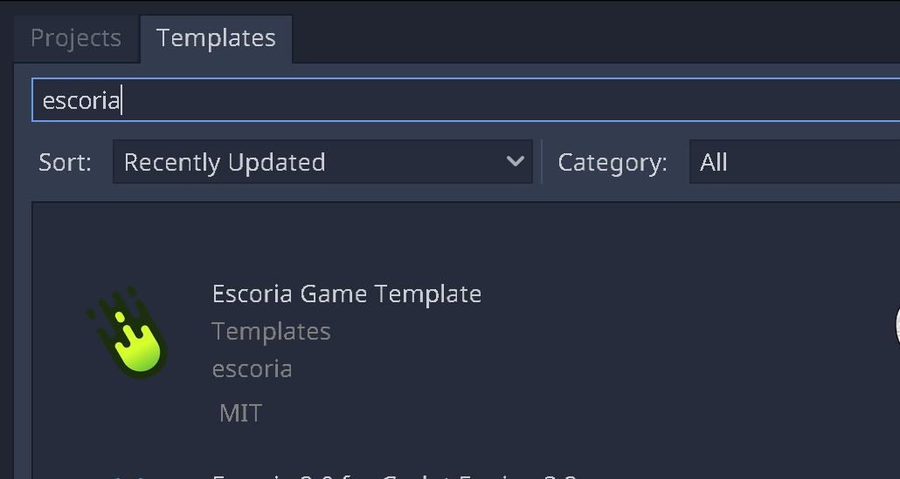

Select the template to view more details:

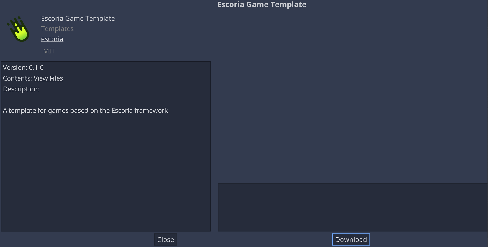

Click on **Download** to download a fresh copy of the template, then click
**Install**.

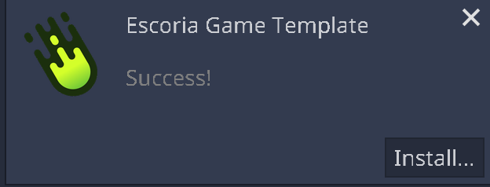

Enter the project name and the folder for your new game.
Click **Install & Edit**.

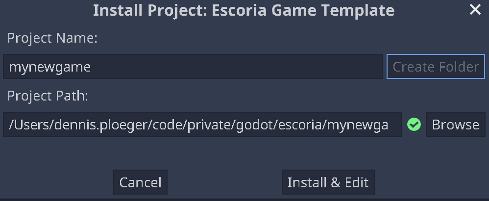

The editor will open your new game.

.. warning::
    After the editor loads the game for the first time, you may need to
    quit to the project manager and reopen the game
    to let Escoria initialize properly.

    If you launched Godot from a terminal then the terminal will display
    error messages at this stage: These messages can be safely ignored.

Adding a stock UI
-----------------

For simplicity's sake in this guide, we will add one of the available stock
UIs that Escoria provides. You will probably want to
use one of them as a starting point for
:doc:`your own game UI </advanced/create_ui>`.

The stock UIs for Escoria are distributed as Godot addons. Switch to the
Asset Lib and search for "escoria*ui" to find all currently available stock
UIs.

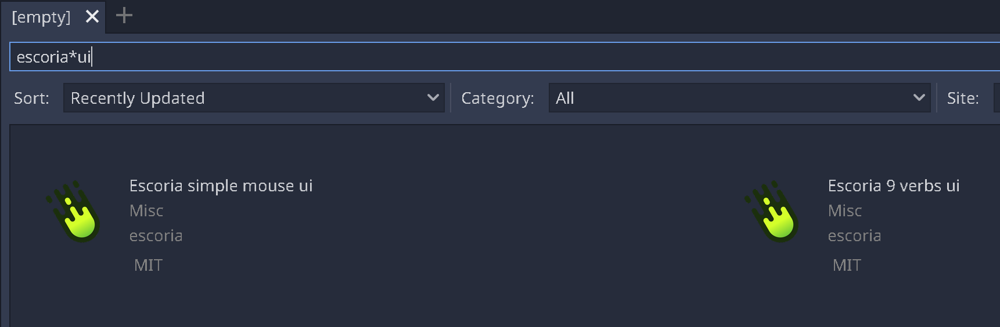

Select one UI to view its details.

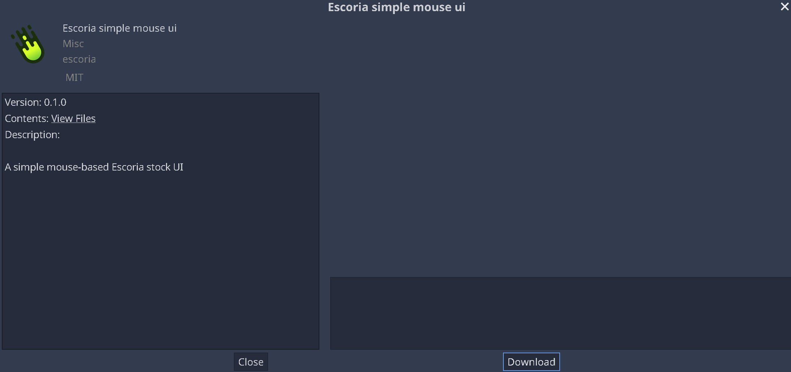

Click on **Download**.

.. image:: img/create_project_ui_downloaded.png
   :alt: The UI addon was downloaded and is ready to install.

Click **Install**. The relevant files should be selected already.

.. image:: img/create_project_ui_install.png
   :alt: View of the files to install.

Open your project settings and switch to the **Plugins** tab to enable the UI
addon.

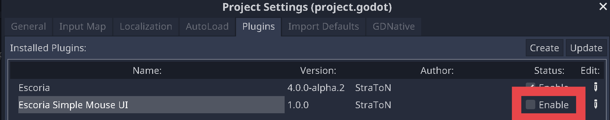
         and a marker on the enable checkbox.

Adding a stock dialog manager
-----------------------------

Usually, a game made with Escoria uses dialog choices as well as the ``say``
command as narrative elements. While the basic dialog handling and the ``say``
command are included in the core, a user interface that *displays* those lines
isn't.

Again, for simplicity's sake in this guide, we will add the available stock
dialog manager that Escoria provides. You will probably want to use it as a
starting point for
:doc:`your own dialog manager </advanced/create_dialog_manager>`.

Like the stock UIs, the dialog manager is distributed as a Godot addon. Switch
back to the Asset Lib and search for "escoria*dialog" to find all currently
available stock dialog managers.

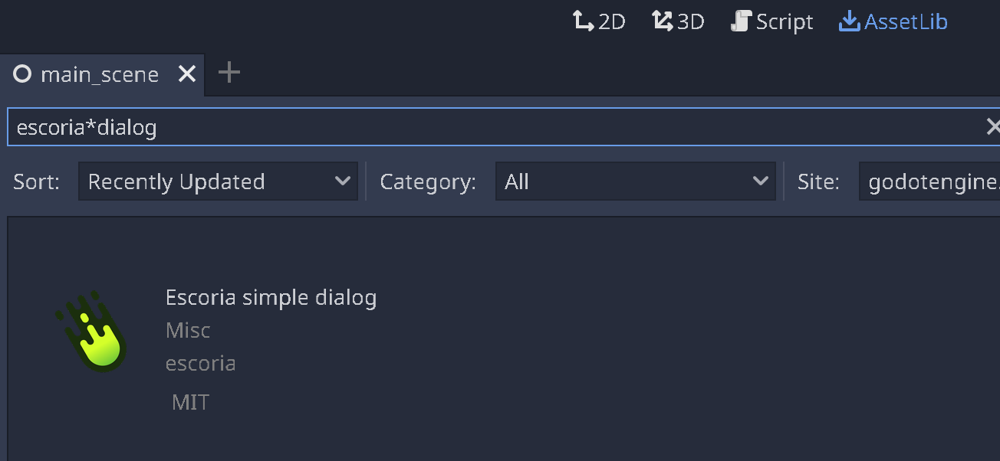

Select one UI to view its details.

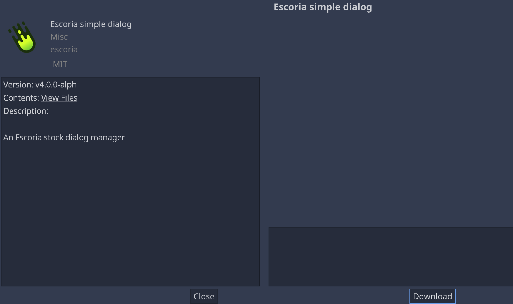

Click on **Download**.

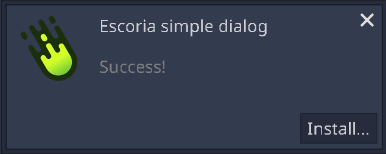

Click **Install**. The relevant files should be selected already.

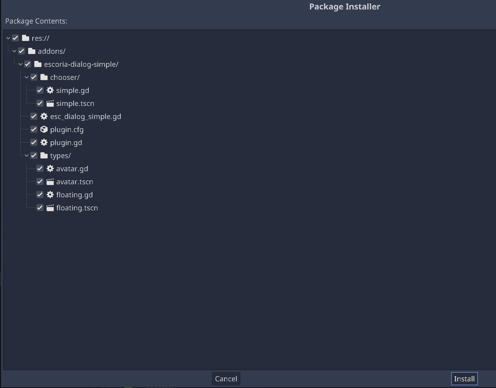

Open your project settings and switch to the **Addons** tab to enable the
dialog manager.

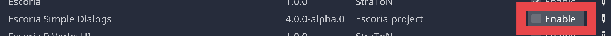
         and a marker on the enable checkbox.

Switch to the project settings and go to "Escoria/UI" to set the default
dialog type parameter. The *dialog type* is the way a line of speech is
displayed to the player. The stock dialog manager supports the following types:

* **floating**: The text is shown above the player sprite
* **avatar**: The text is shown in a box with the player avatar next to it

If the type isn't specified in the ``say`` command, this default type is used.

Let's set it to "floating".

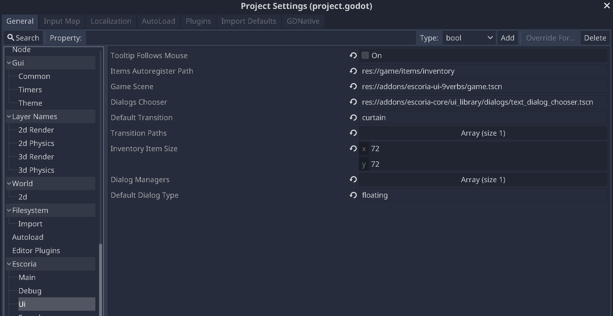
         "floating"

Basic configuration
-------------------

In the general project settings, go to **Display/Window** and set the desired
resolution of your game in the "width" and "height" settings. The Godot
default is 1024x600. The included backgrounds have a height of 956 pixels. For
this guide, setup an HD resolution of 1920x1080 pixels.

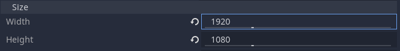

Also make sure that the stretch settings are set to the following:

- Mode: 2d
- Aspect: keep
- Shrink: 1

This makes sure that your game will be resized to match the resolution of the
devices used by the players.

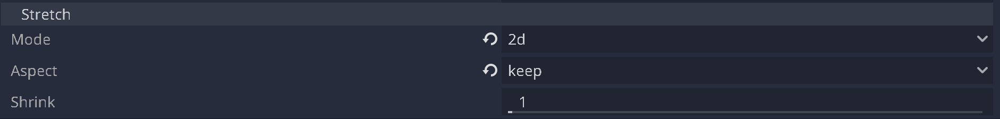

Continuing
----------

After this basic setup, let's
:doc:`create a character <2_create_player_character>`.
