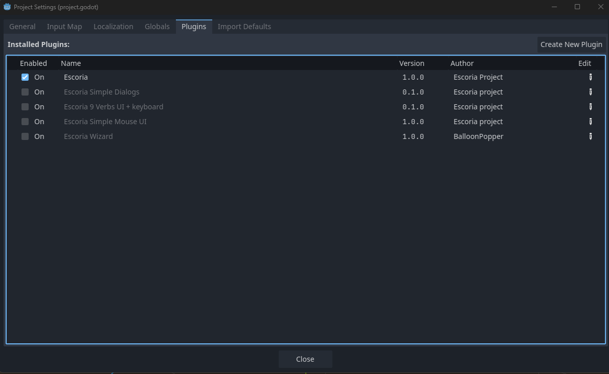
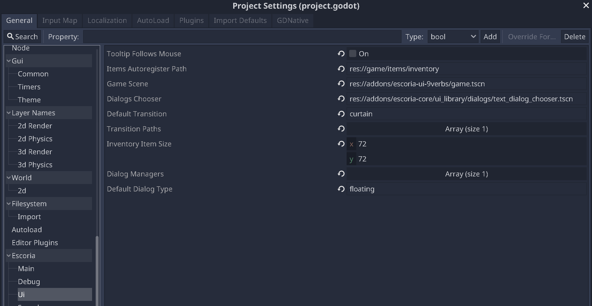
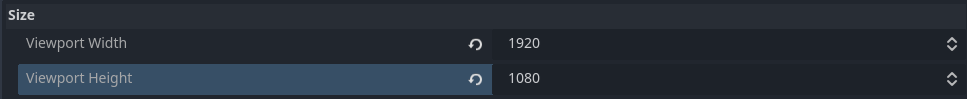
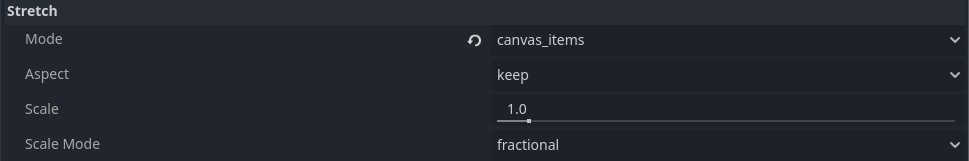

Create an Escoria project
=========================

Escoria's main design is centred around its core addon which supports the
developer with functionality and features to make developing adventure games
as easy and streamlined as possible.

At the same time, Escoria aims to give a lot of freedom to the developer with
regard to the design of the game and its interface.

Because of this, user interfaces are kept separate from the core, as are dialog
managers. This allows for the ease of swapping out implementations of either
that best suit your game. You can use one made completely from scratch, or, to
help get you started, you can use one from Escoria's GitHub repositories.

To make starting with Escoria as easy as possible, we provide a demo game
that comes with stock user interfaces and dialog managers to get you up and
running in no time.

.. hint::

    Previous versions of Escoria were made available in Godot's Asset
    Library. To make sure you have the latest version of Escoria, we
    recommend you clone the `Escoria Demo Game`_ repository and modify/replace
    the addons as needed. We walk through this more below!

Game filesystem structure
-------------------------

Before any files are created, it's important to point out that there is no
mandated filesystem structure for your game. For example, you may
choose to organise your files by :

* purpose (e.g. "/items", "/scripts", "/sprites")
* room (e.g. "/room_ballroom", "/room_study")
* a combination of the two (e.g. "/room_ballroom/scripts",
  "/room_ballroom/items" etc.)
* some other structure

You are not restricted to the structure used by this demonstration project: Use
whatever makes sense for your game.

Starting a new Escoria project
------------------------------

The best way to get started with Escoria is to clone the `Escoria Demo Game`_
from GitHub. Once cloned, you can add, change, or edit any of the stock plugins
that come with the cloned repository.

.. note::

    All of the stock plugins for Escoria are available separately through
    `Escoria's repositories`_, though at the time of writing, the most
    up-to-date versions of the plugins are in `Escoria Demo Game`_.

Start the Godot editor and, through the Project Manager, navigate to and open
the Escoria project you just cloned.

The game will now appear in your editor.

.. warning::
    After the editor loads the game for the first time, you may need to
    quit to the project manager and reopen the game
    to let Escoria initialize properly.

    If you launched Godot from a terminal then the terminal will display
    error messages at this stage: These messages can be safely ignored.

Changing the stock plugins
--------------------------

UI
~~

For simplicity's sake in this guide, we will show how to change the UI to one
of the other available stock UIs that Escoria provides. You will probably want
to use one of them as a starting point for :doc:`your own game UI </advanced/create_ui>`.

The stock UIs for Escoria are distributed as Godot addons, with all of them
available through the `Escoria Demo Game`_.

Adding a new or completely separate UI is a matter of adding a new directory
to under the ``addons/`` directory (e.g. ``addons/my-ui/``)  alongside any
other plugins.

To select Open your project settings, switch to the **Plugins** tab, find the
UI addon you want to use, and enable it.

         and a marker on the enable checkbox.

Dialog manager
~~~~~~~~~~~~~~

Usually, a game made with Escoria uses dialog choices as well as the ``say``
command as narrative elements. While the basic dialog handling and the ``say``
command are included in the core, a user interface that *displays* those lines
isn't.

Like the UI plugin, the available stock dialog manager that Escoria provides
makes getting started with Escoria easy, and you will probably want to use it
as a starting point for :doc:`your own dialog manager </advanced/create_dialog_manager>`.

Like the stock UIs, the dialog manager is distributed as a Godot addon and can
be switched in exactly the same way as the UI plugin.

To configure the dialog manager, switch to the Project Settings and go to
"Escoria/UI" to set the default dialog type parameter. The *dialog type* is the
way a line of speech is displayed in the player.

The stock dialog manager supports the following types:

* **floating**: The text is shown above the player sprite.
* **avatar**: The text is shown in a UI box with the player avatar next to it.

If the type isn't specified in the ``say`` command, this default type is used.

Let's set it to "floating".

         "floating"

Basic configuration
-------------------

In the general project settings, make sure the **Advanced Settings** toggle is
enabled in order to view the settings that are specific to Escoria.

Then, go to **Display/Window** and set the desired resolution of your game in
the **Viewport Width** and **Viewport Height** settings. The Godot default is 1024x600.

The included backgrounds have a height of 956 pixels. For this guide, setup an
HD resolution of 1920x1080 pixels.

Also make sure that the stretch settings are set to the following:

- **Mode**: canvas_items (formerly "2d" in Godot 3)
- **Aspect**: keep
- **Scale**: 1.0

This makes sure that your game will be resized to match the resolution of the
devices used by the players.

Continuing
----------

With the basic setup done, let's
:doc:`create a character <2_create_player_character>`!

.. _Escoria Demo Game: https://github.com/godot-escoria/escoria-demo-game
.. _Escoria's repositories: https://github.com/orgs/godot-escoria/repositories
