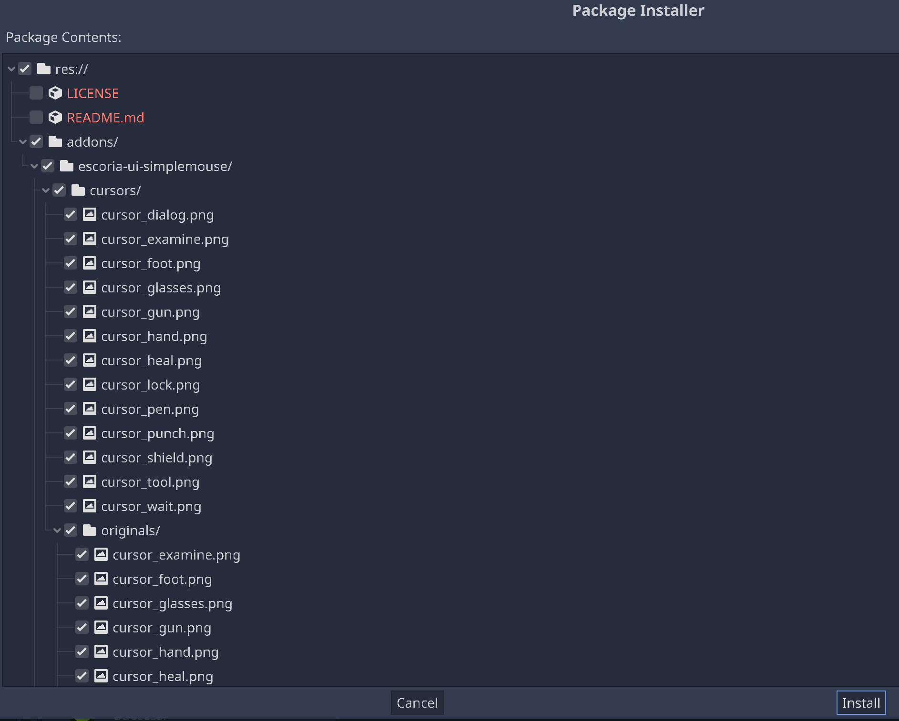

Create an Escoria project
=========================

Escoria's main design is centred around its core addon, which supports the
developer with very basic functionality and features to make developing games
as easy and streamlined as possible.

At the same time, Escoria tries to give a lot of freedom to the developer in
regard to the design of the game and its interface.

Because of this, a specific user interface is not included into Escoria
core for example and can either be installed as additional addons from the
Godot Asset Library or completely done from scratch for the specific game
you're making.

To make starting with Escoria as easy as possible, we provide a Godot Game
Template and stock user interfaces to get you up and running in no time.

Starting a new Escoria project
------------------------------

Open the Godot project manager, switch to the **Templates** tab and search for
the Escoria game template:

.. image:: img/create_project_search_template.png
   :alt: Searching for Escoria in the template library

Select the template to view more details:

.. image:: img/create_project_template.png
   :alt: Details from the Escoria game template

Click on **Download** to download the fresh template, then click **Install**.

.. image:: img/create_project_downloaded.png
   :alt: "Installing the gamte template"

Enter the project name and the folder for your new game.
Click **Install & Edit**.

.. image:: img/create_project_install.png
   :alt: Creating a new game from the template

The editor will open your new game.

.. warning::
    After the editor loaded the game for the first time, you may need to
    quit to the project manager and reopen the game
    to let Escoria initialize properly.

Adding a stock UI
-----------------

For simplicity sake in this guide, we will add one of the available stock
UIs that Escoria provides. You probably want to
use one of them as a starting point for
:doc:`your own game UI </advanced/create_ui>`.

The stock UIs are distributed as Godot addons. Switch to the asset lib and
search for "escoria*ui" to find all currently available stock UIs.

.. image:: img/create_project_uis.png
   :alt: Available Escoria UIs

Select one UI to view the details.

.. image:: img/create_project_ui_details.png
   :alt: The details of the simplemouse ui addon.

Click on **Download**.

Click **Install**. The relevant files should be selected already.

Open your project settings and switch to the **Addons** tab to enable the UI
addon.

.. image:: img/create_project_ui_enable.png
   :alt: A view of the project settings with the addons tab selected
         and a marker on the enable checkbox.

Basic configuration
-------------------

In the general project settings, set the resolution of your game in the
Setting **Display/Window**. The Godot default is 1024x600. The included
backgrounds have a height of 956 pixels. For this guide, setup an HD resolution
of 1920x1080 pixels.

Continuing
----------

After this basic setup, let's
:doc:`create a character <2_create_player_character>`.
