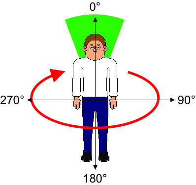
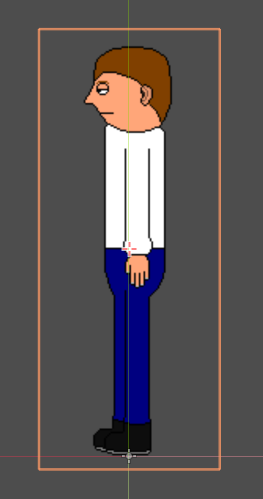

Create a player character
=========================

Escoria is a framework optimized for 3rd person point and click adventure
games. These type of games usually feature an animated character that can walk
across a background graphic and interact with items.

A character in Escoria is based on the node type :doc:`/api/ESCPlayer`.

Create a new folder in the **characters** folder for the new character. We will
call our character "Graham".

.. image:: img/character_create_folder.png
   :alt: A view of the folders with a folder created for the new character

Inside the folder, create a new scene and select ``ESCPlayer`` as the root node
type.

.. image:: img/character_create_scene.png
   :alt: The new character scene with an ESCPlayer root node

When we get to making your game more interactive later using the built-in
ESC Scripting language, we need a way of identifying the character and the
various items. ESC uses :dfn:`global ids` for this. Set the global id for the
character using the parameter **Global id** in the inspector panel:

.. image:: img/character_globalid.png
   :alt: The parameter global_id set to "graham"

Adding a walkcycle
------------------

When a character is moved across the screen, usually an animation is played to
mimic the character walking. This is called a "walkcycle".

Escoria can play different animations based on where the character
is moving to. For example, Escoria will play an upward facing walkcycle if the
character moves from the bottom to the top of the screen, and a right facing
walkcycle if the character walks from to the left to the right hand side.

As Escoria can show mirrored animations, if your character looks the same on
their right and left halves, you will not need animations showing them facing
both left and right. Escoria can mirror any sideways-facing animations (e.g.
walking right, walking up and right, walking down and right) to make the
opposite side's equivalent.

Start by copying the spritesheet image into the character folder.

.. hint::

   Spritesheets combine multiple images of a sprite into one big image and
   are a very efficient way of using images in a game engine.

Then add a new ``AnimatedSprite`` node to the ``ESCPlayer`` node.

Add new animations with the appropriate animation frames using the images from
the spritesheet:

.. image:: img/character_create_animations.png
   :alt: The required animations in the frames configuration.

* back
* backright
* front
* frontleft
* left
* idleback
* idlebackright
* idlefront
* idlefrontleft
* idleleft

Refer to the `AnimatedSprite tutorial in the Godot docs`_ to learn how to do
this if you need some help.

Telling Escoria about the walkcycle
-----------------------------------

Now that the basic animations exist, we need to tell Escoria when to play
which animation.

To achieve this, create a new ``ESCAnimationResource`` in the ``ESCPlayer``
node's ``animations`` parameter:

Click on the new resource to reveal the relevant settings:

.. image:: img/character_create_animation_settings.png
   :alt: The different animation settings

Escoria does not limit the developer in how many walkcycle directions a
character can have. It can be 4 (left, right, front, back), 8 (with diagonal
directions) or even more!

To achieve this degree of freedom, Escoria needs to know which directions are
available. It does that by defining angle ranges within a 360° circle.

     360 degree movement

The angle 0° would show the character facing away from the camera, 90° facing
to the right, and so forth.

The walkcycles only show very specific angles for the character (e.g. for a 4
direction character there are only animations for angles 0, 90, 180 and 270
degrees). When the player moves the character in a direction that isn't one of
these angles, however, Escoria needs to work out which animation the developer
would like to use. To do this, when defining a character animation, the
developer provides the angle range that will match that animation direction.
In this diagram, the green area shows that the developer has chosen that
movement in the 40° angle starting from 340° (i.e.  from 340° to 20°) will
correspond to the "up" animation.

.. image:: img/angles_visualization2.png
   :alt: The movement range matching the upward walking animation

Our character will support walking in 8 directions, so we set up the
``Dir angles`` parameter like this:

Click on ``Dir Angles`` and set the size to 8. For each slot, add an
``ESCDirectionAngle`` resource.

.. image:: img/character_create_animation_dirangles.png
   :alt: Setting the Dir angles array

Click on each resource and set its angle start and size settings based on the
8-direction character table below.

This will define 40° ranges for the upper, left, right and back animations as
well as 50° ranges for the diagonal directions. This setup will result in a
very smooth animation.

.. warning::

   Make sure that you always define the complete 360° circle when defining a
   character's direction angles!

2-direction Character

+--------------+------------+-------------+------------+
| Resource     | Walk       | Character   | Character  |
| Table Entry  | Direction  | Start Angle | Angle Size |
+==============+============+=============+============+
| Entry 1      | Up         |           0 |        180 |
+--------------+------------+-------------+------------+
| Entry 2      | Up Right   |         180 |        180 |
+--------------+------------+-------------+------------+

4-direction Character

+--------------+------------+-------------+------------+
| Resource     | Walk       | Character   | Character  |
| Table Entry  | Direction  | Start Angle | Angle Size |
+==============+============+=============+============+
| Entry 1      | Up         |         315 |         90 |
+--------------+------------+-------------+------------+
| Entry 2      | Right      |          45 |         90 |
+--------------+------------+-------------+------------+
| Entry 3      | Down       |         135 |         90 |
+--------------+------------+-------------+------------+
| Entry 4      | Left       |         225 |         90 |
+--------------+------------+-------------+------------+

8-direction Character

+--------------+------------+-------------+------------+
| Resource     | Walk       | Character   | Character  |
| Table Entry  | Direction  | Start Angle | Angle Size |
+==============+============+=============+============+
| Entry 1      | Up         |         340 |         40 |
+--------------+------------+-------------+------------+
| Entry 2      | Up Right   |          20 |         50 |
+--------------+------------+-------------+------------+
| Entry 3      | Right      |          70 |         40 |
+--------------+------------+-------------+------------+
| Entry 4      | Down Right |         110 |         50 |
+--------------+------------+-------------+------------+
| Entry 5      | Down       |         160 |         40 |
+--------------+------------+-------------+------------+
| Entry 6      | Down Left  |         200 |         50 |
+--------------+------------+-------------+------------+
| Entry 7      | Left       |         250 |         40 |
+--------------+------------+-------------+------------+
| Entry 8      | Up Left    |         290 |         50 |
+--------------+------------+-------------+------------+

Now that we have defined where we want Escoria to play character animations,
we just need to connect the individual animations with the direction angles.

The additional parameters of the ``ESCAnimationResource`` define the
specific animations for the character for each direction angle:

* ``Directions``: Walk animation
* ``Idle``: Idle animations
* ``Speak``: Speaking animations

.. hint::

   The ``Speak`` animations are optional and only required if your game needs
   them.

For each direction angle, each slot needs to contain a ``ESCAnimationName`` resource. Put the name of the matching walking animation (with the name specified in "Adding a walkcycle" above) in the "Animation" field, and choose
whether that animation should be played mirrored by selecting the "Mirrored"
checkbox.

These are the the first 3 settings for the ``Directions`` parameter:

Try to set up the ``Directions`` and ``Idle`` animations by yourself.
Don't forget to click ``Mirrored on`` when the image is facing the
opposite direction (for instance we have a left animation and
item numbered 2 in our arrays corresponds to moving right so, in the
above screenshot, item 2 uses a mirrored version of the left animation).

.. hint::

   If you ever get stuck in designing your game, why not check out
   the community on our `Discord`_ server? We're always happy to help.

   .. image:: https://img.shields.io/discord/884336424780984330.svg?label=Join%20our%20Discord&logo=Discord&colorB=7289da&style=for-the-badge
      :alt: Join our Discord
      :target: https://discord.com/invite/jMxJjuBY5Z

Defining the character base position
------------------------------------

Escoria will move the character sprite around based on a specific position
in the character scene, which is usually located at the bottom of the character
sprite.

We can define this position by moving the sprite up so its feet are located
at the origin of its scene:

     scene

Preparing the character for interactions
----------------------------------------

To detect interactions in the game such as when a character reaches an exit
or moves onto a trigger, Escoria uses Godot's built-in collision detection. For
this to work, we need to add a collision shape to the character which roughly
defines its outline.

Add a ``CollisionShape2D`` node to the ``ESCPlayer`` and use a
``CapsuleShape2D`` shape to cover the sprite.

.. image:: img/character_create_collision.png
   :alt: A CapsuleShape2D is covering the sprite

This concludes creating a player character. Let's
:doc:`create a room <3_create_room>`.

.. _AnimatedSprite tutorial in the Godot docs: https://docs.godotengine.org/en/stable/tutorials/2d/2d_sprite_animation.html
.. _Discord: https://discordapp.com
