Create a room
=============

A **room**, in Escoria terminology, is an environment where the player moves around
without changing the point of view or the background. You can think of it as
a "shot" in filmmaking.

Under the ``game/rooms/`` folder, create a new folder to contain the files of the
room scene we'll now create. Let's call it "pub".

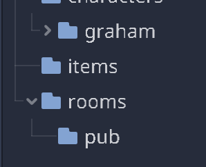

Create a new scene and set its root node to be an ``ESCRoom``.

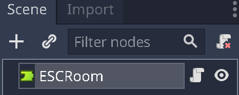

Save the scene as "pub.tscn".

.. note:: You can call the scene something other than "pub.tscn" if you want -
  "room1.tscn" for example. Make sure you name things in a way that makes sense
  to your game.

Like the character we created, the room also requires a ``global id``, so set the
property **Global id** to "pub".

We want to play as Graham in this scene, so select it as the
``Player Scene`` property:

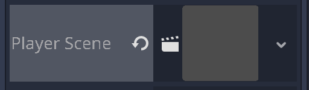
     selected.

Adding a background to the room
-------------------------------

Our room requires an ``ESCBackground`` node. This node is necessary in
order to capture input events for the background of the room. It can also
display a background image. Add the node as a child of the root node.

Currently, the background node is empty. From ``backgrounds.zip``, copy the
file "pub_bg.png" to the ``game/rooms`` directory and set it as the ``Texture``
property in the ``ESCBackground`` node.

This will additionally set the dimensions of the ``ESCBackground`` node to the
size of the image.

.. hint::

    Backgrounds in Escoria can also be bigger than the game display size.
    Escoria will take care of moving the camera around when the character
    reaches the border of the screen.

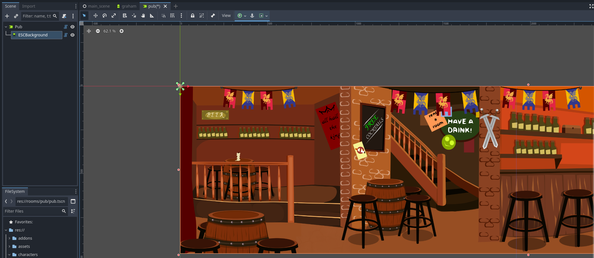

Setting walkable areas for the character
----------------------------------------

Usually, characters aren't allowed to move freely around in the whole room.
There may be walls and other obstacles blocking their paths.

To set the areas in which characters can walk in a room, add an ``ESCTerrain``
node to the ``ESCRoom`` node: It will manage the walkable areas as well as
other functionality such as light- and scale-mapping.

To setup a single walkable area, add a new ``NavigationRegion2D`` node
to the new ``ESCTerrain`` node:

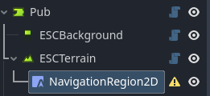

Then create a new ``NavigationPolygon`` resource for the ``Navigation Polygon``
property in the **Inspector** panel.

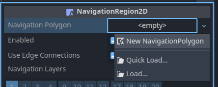

Use the editor window to draw a polygon. This polygon is the area in which the
character is allowed to move around freely.

.. warning::

   Remember that Escoria is using the character's **base position** (*not the
   character scene's center*) when moving inside the walkable areas, so watch
   out that navigating through the room doesn't bring the character too close
   to the walls or else the character will be drawn overtop of them!

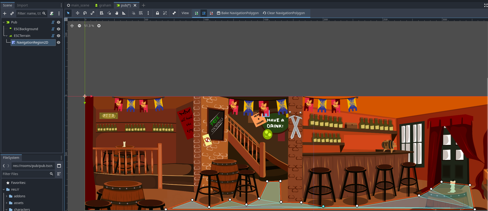

.. note::

   Escoria supports having multiple walkable areas (represented by multiple
   ``NavigationRegion2D`` instances). These can be switched by using an ASHES
   command (:doc:`enable_terrain <../../api/commands/EnableTerrainCommand>`) in the game.
   This is useful for things like blocked passages which can be unblocked by
   pressing a button in the game.

.. hint:: **Light mapping**

   Rooms in adventure games sometimes don't have one fixed global light, but
   instead feature things like lamp shades and darker (or lighter) areas.

   This can be achieved in Escoria by setting up a **light map** in the
   ``ESCTerrain`` node.

   A light map is a simple texture in which its colors are mapped to the
   character's colors as it walks around the room.

Scale mapping
-------------

If the background of the room is a three-dimensional image and the upper
part of the image appears to be further away, scale mapping is
used to create a three-dimensional effect when the character moves from the
top to the bottom of the screen by making its sprite smaller when it's
closer to the top of the screen and bigger when the character reaches the
bottom of the screen.

This is achieved in Escoria by using a greyscale texture: The darker parts
of the texture are considered to be further away from the viewer while the
lighter parts are considered to be closer to the viewer.

To fine tune the scaling of the character, use the ``Scale min`` and
``Scale max`` parameters of the ``ESCTerrain`` node. The character is
scaled only between the numbers given in ``Scale min`` and ``Scale max``,
with 0 meaning the character is scaled down to non-existence and 1
representing the actual size of the character.

.. note::

  The scaling can also be greater than 1, which can result in scaling
  artifacts. Try using sufficiently large images for sprites if you require
  the character to appear bigger in some scenes.

For our example, we will simply add the scale map to the pub room by
selecting its ``ESCTerrain`` node, then loading the ``pub_scalemap.png`` file
into the ``Scales`` parameter of the node in the Inspector.

For the ``Scale min`` and ``Scale max`` parameters, we suggest values of 1.1
and 2.2 respectively, but you are welcome to try different values to observe
the change in the size of the player when moving closer to or further from
the camera.

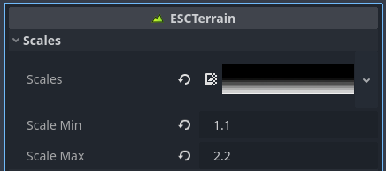

Setting camera limits
---------------------

As was mentioned before, the background can be much bigger than the screen
size, and in this example it really is: The background texture is 3976x956
pixels big!

However, using "Camera limits", we can tell Escoria that it can pan over the
complete background using the game camera.

Select the ``ESCRoom`` node and set the first entry of the
``Camera limits`` property to: x = 0, y = 0, w = 3976, h = 956:

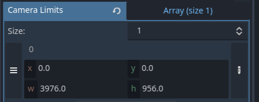

Setting a starting location
---------------------------

We have to tell Escoria where our character should start in the new scene.

For pointing out specific locations, we can use an ``ESCLocation`` node.

Add one to the scene  and set its name to "start", so that we know what
this location represents.

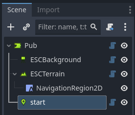

.. hint::

    It is generally recommended to give nodes a meaningful name, especially
    in bigger, more complex rooms. Doing so always proves to be very helpful.

In the "start" node's properties, set the ``global id`` and select the ``Is start location``
checkbox property.

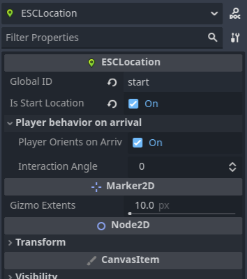

That's about it for the setup! Now
:doc:`let's try out our new game for the first time <4_first_run>`.
