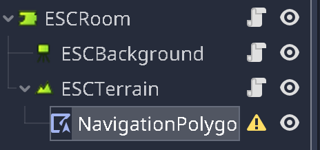

Create a room
=============

A room, in Escoria terminology, is an environment where the player moves around
without changing the point of view or the background. You can think of it as
a "shot" in filmmaking.

In the **rooms** folder, create a new folder to contain the files of the
room scene we'll now create: let's call it "pub".

Create a new scene named "room01" and set `ESCRoom` as its root node.

Like the character, the room also requires a ``global id``, so set the
parameter **Global id** to "pub".

We want to play with Graham in this scene, so select it for the
``player scene`` parameter:

     selected.

Adding a background to the room
-------------------------------

Now, our room requires an ``ESCBackground`` node. This node is mandatory to
capture input events on the background of the room. It can also display a
background image. Add it as child of the root node.

Currently, the background node is empty. From the backgrounds.zip copy the file
"pub_bg.png" to the room directory and set it as the ``texture``-parameter
in the ``ESCBackground`` node.

This will additionally set the dimensions of the ``ESCBackground`` node to the
size of the image.

.. hint::

    Backgrounds in Escoria can also be bigger than the game display size.
    Escoria will take care of moving the camera around, when the character
    reaches the border of the screen.

Setting walkable areas for the character
----------------------------------------

Usually, characters aren't allowed to move freely around in the whole room.
There are walls and other obstacles blocking their path.

To set the areas in which characters can walk in a room, add a ``ESCTerrain``
node to the ESCRoom node. It will handle the walkable areas and also things
like light and scale mapping.

To setup the walkable area, add a new ``NavigationPolygonInstance`` node to the
new ``ESCTerrain`` node:

Then create a new ``NavPoly`` resource for the Navpoly
parameter in the Inspector panel.

Use the editor window to draw a polygon. This polygon is the area in which the
character can move around freely.

.. warning::

   Remember that Escoria is using the character's base position when checking
   the walkable areas, so watch out that navigating through the room doesn't
   bring the character too close to the walls, else it will be drawn over the
   walls.

.. note::

   Escoria supports having multiple walkable areas (represented by multiple
   ``NavigationPolygonInstance``s), which can be switched by an ESC command
   in the game. This is useful for things like blocked passages which can be
   unblocked by pressing a button in the game.

.. hint:: **Light mapping**

   Rooms in adventure games sometimes don't have one fixed global lighting, but
   instead feature things like lamp shades or darker or lighter areas.

   This can be achieved in Escoria by setting up a light map in the
   ``ESCTerrain`` node.

   The light map is a simple texture which colors are mapped to the character's
   colors as it walks around in the room.

.. hint:: **Scale mapping**

   If the background of the room is a three dimensional image and the upper
   part of the image appears to be further away, scale mapping is
   used to create a three dimensional effect when the character moves from the
   top to the bottom of the screen by making it smaller when it's
   on the top of the screen and bigger when it reached the bottom of the
   screen.

   This is achieved in Escoria by using a grayscale texture. A darker part of
   the texture is considered to be further away from the viewer and a lighter
   part is more in front of the viewer.

   To finetune the scaling of the character use the "Scale min" and "Scale max"
   arameters. The character is only scaled between the numbers
   given in "Scale min" and "Scale max", with 0 meaning the character is scaled
   down to non-existence and 1 for the actual size of the  character.

    .. note::

        The scaling can also be bigger than 1, which can result in scaling
        artifacts.

For simplicity's sake, we don't set up a complex scale map right now, but as
the character is smaller than it should be displayed in the room, set
"Scale min" and "Scale max" to 2, so the character sprite will be shown
at twice its size.

Setting camera limits
---------------------

Like said before, the background can be much bigger than the screen size, which
in this example it really is. The background texture is 3976x956 pixels big.

However, using "Camera limits" we can tell Escoria that it can pan over the
complete background using the game camera.

Select the ``ESCBackground`` node and set the first entry of the
"Camera limits" parameter to 0, 0, 3975, 956:

Setting a starting location
---------------------------

We have to tell Escoria where our character should start in the new scene.

For pointing out specific locations, we can use the ``ESCLocation`` node type.

Add one and rename it to "start", so we know what this location is about.

.. hint::

    It is generally recommended, to give nodes a meaningful name. Especially
    with bigger, complex rooms, this provides to be very helpful.

In its parameters, set a ``global id`` and select the "Is start location"
checkbox parameter.

That's about it for the setup, now
:doc:`let's try out our new game for the first time <4_first_run>`.
