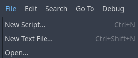
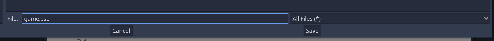
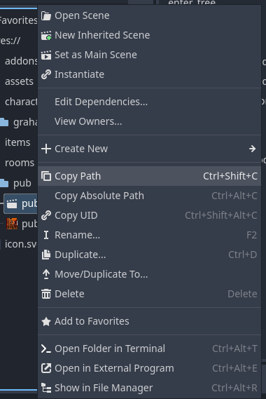
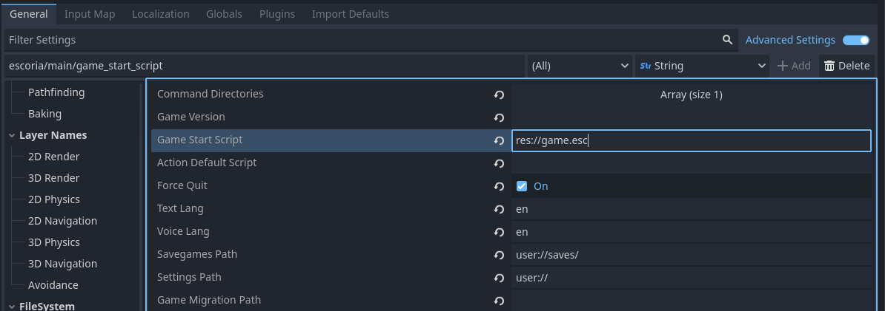
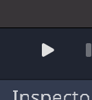

The first run
=============

We'd like to test out what we have done so far, but first we need to tell
Escoria what to do when a new game starts!

Our first ASHES script
----------------------

This is done using **ASHES**, the integrated Escoria scripting language.

While you could use :dfn:`GDscript` (or other languages supported by Godot)
directly, we added ASHES as a language tailor-made for adventure games,
so the most typical game commands (like making a character speak, letting them
walk across the room, etc.) are very easy to use.

The game's start-up routine itself is also coordinated using an ASHES script.

Scripts are plain text files with an ".esc" extension, created in any text
editor you choose to use. 

Create a new ASHES script which will be our main game script and call it 
"game.esc".

Switch to Godot's **Scripts** tab and select "New Text File" from the "File" menu:

.. note:: In the future, the ".esc" extension will be replaced by  
  ".ash", but for compatibility reasons the original ".esc" extension 
  should be used for the time being.

Save the new file as "game.esc" in your root game folder:

This will open the new script directly in the editor.

ASHES scripts are built-up using "Events" and "Commands".

An ASHES Event starts with a colon (``:``) and is followed by the name of the
event, e.g. ``:look``

There are several special names for events which you will learn later on, but 
the one event type we need right now is ``newgame`` which is run when the player 
clicks on the "New Game" button in the main menu.

.. hint::

   There is also a special event called ``setup``. This is related to
   the order things happen in more complex game rooms and is not necessary for
   every script. It can be safely ignored for now.

We basically just want Escoria to switch to our new pub scene. For this, we can
use the command :doc:`change_scene <../api/commands/ChangeSceneCommand>`. This 
command expects the path to the target scene as an argument.

Getting that path is easy to do in Godot: Just find the pub scene in the file tree,
right click on it, and select "Copy Path" from the context menu:

Now add the following to the ASHES script ``game.esc``:

.. code-block::

  :newgame

    change_scene("res://rooms/pub/pub.tscn")

.. hint::

  All ASHES events should appear as the first word on its own line, without any 
  spaces or indents to its left!
    
.. hint::

  ASHES is similar to GDScript and Python: Make sure to indent script blocks appropriately 
  (more on this in the :doc:`ASHES Language Reference </scripting/z_esc_reference>`).
    
.. hint::

   If you saved the scene using a name other than "pub.tscn" (e.g. "room1"), 
   the argument above should reflect that scene's path, e.g. "res://rooms/pub/room1.tscn")..

But what should happen when the game starts *before* the main menu is shown?

Well, that's also handled by the same script by using an ``init`` event.

You could add introduction sequences, studio logos, etc. to that event. For the moment, 
we only want to show the main menu--*further evidence of Escoria being very adaptable to 
your specific game's needs!*

Thus, we don't default to any main menu scene. We've added a stock main menu for convenience, 
though, which we will load now.

Add this code to the script:

.. code-block::

  :init

    show_menu("main")

This instructs the installed UI addon to show the main menu.

The complete script file should look like this now:

.. code-block::

  :init

    show_menu("main")

  :newgame

    change_scene("res://rooms/pub/pub.tscn")

Now that we have our game script ready, we need to set it in the Escoria
project settings using the **Game Start Script** parameter in the **Main** category.

.. hint::

  Remember that you may need to enable the **Advanced Settings** toggle in order 
  to see the Escoria-specific project settings!

The setting should look like this.

.. hint::

   You can copy the path to the ASHES file by right-clicking the file in the 
   editor:

   .. image:: img/start_game_scriptpath.png
      :alt: The context menu shown when the script game.esc is right clicked
        in th editor.

Starting the game
-----------------

We need to make sure that Escoria knows which **game scene** to use. A game 
scene is used by Escoria as the "entry point" for the entire game and typically 
contains a complete implementation of a user interface (UI).

.. hint::

  Make sure a valid game scene is specified in the Escoria project settings under 
  "UI" -> "Game Scene".

Now you're ready to start the game! Click on Godot's run icon to do so.

Click on "New Game" in the main menu and check out your character walking
around in the new room!

Slowing Graham down
-------------------

As you can see, Graham is pretty much running through the pub. Also, he looks
a bit like he's skating through it.

So we should make him walk slower and at the same time speed up the walking 
animation.

To achieve this, go back to the character, select the ``ESCPlayer`` node, 
and set the ``Speed`` property to "150". Additionally, select the
``AnimatedSprite2D`` node and set the ``Speed scale`` parameter to "1.8".

Try starting the game again. Graham should walk much more naturally.

Next, let's make the :doc:`room more interactive <5_adding_items>`.

