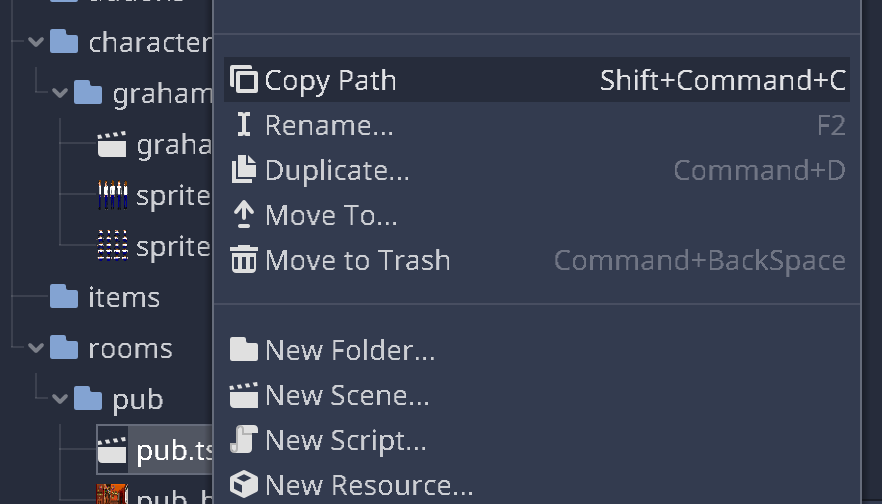

The first run
=============

We'd like to test out what we have done so far, but first we need to tell
Escoria what to do when a new game starts.

Our first ESC script
--------------------

This is done using **ESC**, the integrated Escoria scripting language.

While you could use :dfn:`GDscript` (or other languages supported by Godot)
directly, we added ESC as a specific language for adventure games,
so very typical game commands (like making a character speak, letting them
walk across the room, etc.) are very easy to use.

The game start-up itself is also coordinated using an ESC script.

Create a new ESC script which will be our main game script and call it
"game.esc". Switch to the **Editor** tab and select "New Text File" from the
"File" menu:

Save the new file as "game.esc" in your root game folder:

This will open the new script directly in the editor.

ESC scripts are built-up using "Events" and "Commands".

An ESC Event starts with the ":" character and is followed by the name of the
event.

There are several special names for events which you will learn later on. One
special event name is called ``newgame`` and is run when the player clicks
on the "New Game" button in the main menu.

We basically just want Escoria to switch to our pub scene. For this, we can
use the command :doc:`change_scene </api/ChangeSceneCommand>`. This command
expects the path to the target scene as a parameter.

That's easy to do in Godot: Just select the pub scene in the file tree,
right click it and select "Copy Path":

Add the following to the ESC script ``game.esc``:

.. code-block::

   :newgame

   change_scene res://rooms/pub/pub.tscn

But what should happen when the game starts *before* the main menu is shown?

Well, that's also handled by this script using an "init" event.

You could add introduction sequences, studio logos, etc. For the moment, we
only want to show the main menu. 

(Further evidence of Escoria being very adaptable to your specific game's 
needs!)

Thus, we don't default to any main menu scene by default. We've added a stock
main menu for convenience, though, which we can load now.

Add this code:

.. code-block::

   :init

   spawn _main_menu res://game/ui/commons/main_menu/main_menu.tscn false
   set_active _main_menu true

We won't go into details here, but this code creates a new game item for the
main menu on demand and shows it.

The complete file "game.esc" should look like this now:

.. code-block::

   :init

   spawn _main_menu res://game/ui/commons/main_menu/main_menu.tscn false
   set_active _main_menu true

   :newgame

   change_scene res://rooms/pub/pub.tscn

Now that we have our game script ready, we need to set it in the Escoria
project settings in the "Game Start Script" parameter in the "Main" category.

.. hint::

   ESC files aren't directly shown in the file explorer as they're not
   recognized as Godot resource files (as of the time this was written). 
   As an alternative to copying the path to the ESC file, you can right 
   click the file in the editor:

   .. image:: img/start_game_scriptpath.png
      :alt: The context menu shown when the script game.esc is right clicked
        in th editor.

The setting should look like this.

Starting the game
-----------------

Now you're ready to start the game. Click on Godot's run icon to do so.

Click on "New Game" in the main menu and check out your character walking
around in the new room!

Slowing Graham down
-------------------

As you can see, Graham is pretty much running through the pub. Also, he looks
a bit like he's skating through it.

So we should make him walk slower and at the same time animate him faster.

To achieve this, go back to the character and select the ``ESCPlayer`` node
and set the ``Speed`` parameter to 150. Additionally, select the
``AnimatedSprite`` node and set the ``Speed scale`` parameter to 1.8.

Try starting the game again and watch Graham walk much more naturally.

Let's make the :doc:`room more interactive <5_adding_items>`.
