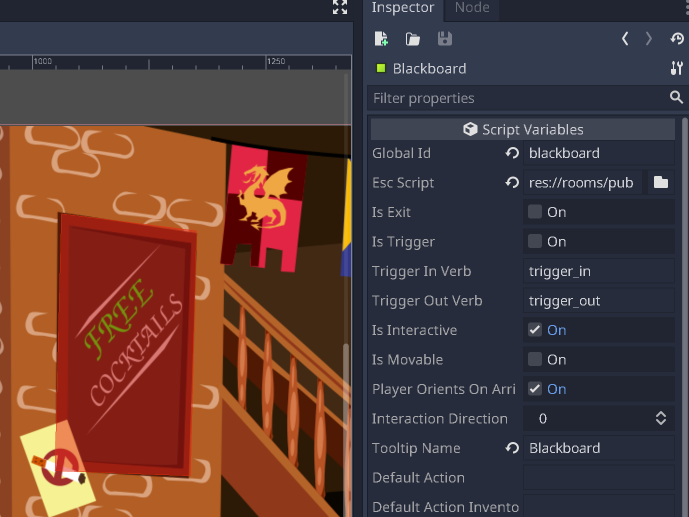
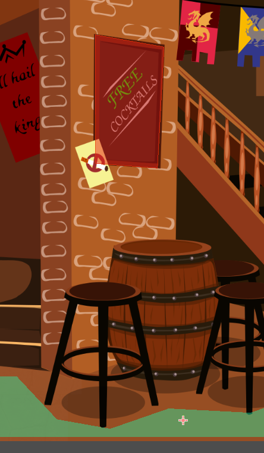
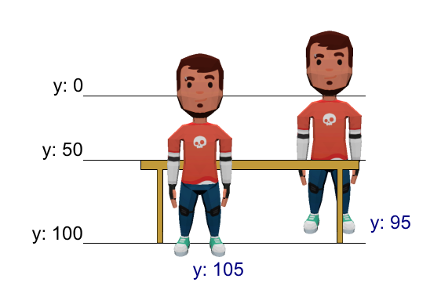

Adding items
============

So far, so good, but walking around in a room is pretty boring, right?

Also, if you move the character to the right side of the room, it walks
over the barrels in the background.

Let's fix both and start by making the room interactive.

Adding an activity
------------------

Let's make Graham comment on the "Free cocktails" note on the blackboard.

Add an ``ESCItem`` node to the ``ESCRoom`` and call it "Blackboard". Set
its ``Global id`` parameter to "blackboard".

Next, add a ``CollisionPolygon2D`` node to the ``ESCItem`` node and draw
a polygon around the blackboard image in the background. This will make
that area a hotspot to click on.

.. hint::

    The ``ESCItem`` node also has a ``Tooltip`` parameter that can be used
    by UIs to display a hint about the item when the mouse is hovering over
    it. For example, the simplemouse UI displays the tooltip next to
    the mouse cursor.

Now that we told Escoria that the blackboard area is interactive, we still
need to tell it what to do if the player, for example, uses the verb "look" on
it.

For this, we go back to ESC. First, we create a new ESC file in the pub folder
and call it "blackboard.esc".

We connect this to the blackboard item. The blackboard item should look like
this now:

     the settings in the inspector

Using events, we can tell Escoria what to do when the player carries out
actions on the item.

Events are called in much the same way as the verbs that the player uses.

.. note::

    Escoria uses the term "verb" to describe the action that the player wants
    to carry out. In the "9 verbs" UI, this is achieved with buttons that
    represent each verb directly (like "look", "use" or "walk"). In the
    simple mouse UI, the verb is expressed by different mouse
    cursors (e.g. a magnifying glass expresses the "look" verb).

An example of an event might be if we want to make Graham say something when
the player "looks" at the blackboard.

For this, we add a new event ``:look`` to our ESC file and use the ``say``
command to make Graham talk:

.. code-block::

    :look
    say graham "That's good to hear. I'm thirsty."

The ``say`` command expects the player character's global ID as the first
parameter and the text to say as the second parameter. (See the
:doc:`documentation </api/SayCommand>`)

If you don't define an ``ESCLocation`` in your player scene, dialog will
appear at the top of the screen.

So add an ``ESCLocation`` as a child of ``ESCPlayer``.

Name this node "dialog_position" (this name is mandatory).

By default, dialog will appear under the character. You can move the node above
Graham's head to have dialog appear in a more regular location.

Try it out! Depending on which UI you chose, select either the look verb or
the look cursor and click on the blackboard. You should notice that Graham
will neither walk to the blackboard nor speak the line we coded above.

.. hint::

    By default, Escoria uses the ``ESCItem``'s position when the player
    attempts to reach it. The blackboard ``ESCItem`` is located at position
    ``(0,0)`` in the room. Since this position is out of reach (i.e. it is not
    included in the ``NavigationPolygon`` in the ``ESCTerrain``), Graham is
    unable to reach it.

    To fix this issue, we need to add an interaction position to the blackboard
    ``ESCItem`` so that Escoria will then use this specific position instead of
    the ``ESCItem`` position itself.

Simply add a new ``ESCLocation`` node as a child of the blackboard ``ESCItem``
and move it in front of the blackboard, around position ``(1216,912)``.

     scene

Run the game again: Graham should now walk to the blackboard and the text above
should be displayed.

Making the player walk behind items
-----------------------------------

The other thing we should address is making Graham move *behind* the barrels
instead of overtop of them in order to achieve a three-dimensional effect.

For this, we've added an asset that only includes the barrels on a transparent
background.

Again, add a new node to the ``ESCRoom`` node and select
``ESCItem`` as the node type. Name it "Barrels". Add a ``Sprite`` node to
this new item and set the texture to the foreground barrels picture.

.. hint::

    You can use a lot of different node types as children of ``ESCItems``
    where it makes sense to - ``AnimatedSprite``, ``AnimationPlayer``,
    or ``Polygon2D`` for example.

    If you use a control node like ``TextureRect`` or ``ColorRect``,
    they will cause problems with mouse interactions. You will need to
    modify the properties of the ``TextureRect`` / ``ColorRect`` and set the
    "Mouse Filter" setting to "Ignore".

Move the new item so it is directly over the barrels in the background. You
can use the arrow keys of your keyboard for more precision.

To make Graham walk behind the barrels, Escoria uses a little trick:
The property ``z-index`` is used by Godot to know which object to draw first.

Objects with a lower z-index are drawn first while objects with a higher
z-index are drawn last which are drawn over the ones with a lower z-index (
this is in addition to the node order in the scene tree where the bottom-most
nodes are drawn last).

Escoria constantly updates the parameter ``z-index`` of the player character to
match the value of its y axis. This makes it possible to define objects where
the player walks behind *and* in front of depending on its y position.

See this graphic:

When the character is at y position 95, it stands behind the table. At y
position 105, it stands in front of the table. To achieve this effect in
Escoria, we simply set the "z-index" property of the table item to 100.

For the barrels, though, the character should never walk in front of them,
only behind them. So we can set the barrels' ``z-index`` property to the
height of the background, or simply 1.000 for this example.

.. hint::

    To figure out the proper value of the ``z-axis`` parameter, you can use the
    ruler feature of Godot to measure the y position of where the base
    position of your character needs to be to switch to walking in front.

.. warning::

    Another property, ``Z As Relative``, is checked by default, meaning that
    the ``z-axis`` property will also take the ``z-axis`` property of its
    parent (in this case, the ``ESCRoom`` node). Usually, the ``z-axis``
    property of the parent is set to 0, but keep this in mind in case it isn't
    and the walkbehind effect doesn't work properly.
