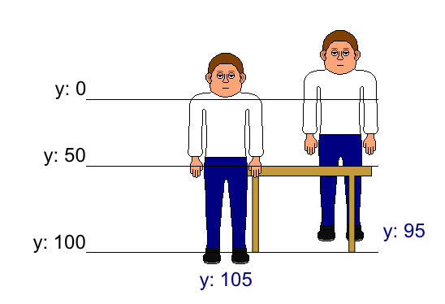

Adding items
============

So far so good, but walking around in a room is pretty boring, right?

Also, if you move the character to the right side of the room, it walks
over the barrels in the background.

Let's fix both and start with making the room interactive.

Adding an activity
------------------

Let's make Graham comment the "Free cocktails" note on the blackboard.

Add an ``ESCItem`` node to the ``ESCRoom`` and call it "Blackboard". Set
it's "Global id" parameter to "blackboard".

Then, add a ``CollisionPolygon2D`` node to it and draw a polygon around the
blackboard image in the background. This will make that area a hotspot to
click on.

.. hint::

    The ``ESCItem`` node also has a "Tooltip" parameter, that can be used
    by UIs to display a hint about the item, when the mouse is hovering over
    it. For example, the simplemouse UI displays that tooltip next to
    the mouse cursor.

Now that we told Escoria, that the blackboard area is interactive, we still
need to tell it what to do if the player for example uses the verb "look" on
it.

For this, we get back to ESC. First, we create a new ESC file in the pub folder
and call it "blackboard.esc".

We connect this to the Blackboard item. The blackboard item should look like
this right now:

.. image:: img/adding_items_blackboard.png
   :alt: The blackboard with the CollisionPolygon2D over it in red color and
     the settings in the inspector

Using events, we can tell Escoria what to do when the player carries out
actions on the item.

The event is called like the verb that the player uses.

.. note::

    Escoria uses the term "verb" to describe the action that the player wants
    to carry out. In the "9 verbs" UI, this is achieved by buttons that
    represent each verb directly (like "look", "use" or "walk"). In the
    simple mouse UI, for example, the verb is expressed by different mouse
    cursors (a magnifying glass expresses the "look" verb).

For example we want to make Graham say something when the player "looks" at
the blackboard.

For this, we add a new event ":look" to our ESC file and use the ``say``
command to make Graham talk:

.. code-block::

    :look
    say graham "That's good to hear. I'm thirsty."

The ``say`` command expects the player character's name as the first parameter
and the text to say as the second parameter. (see the 
:doc:`documentation </api/SayCommand>`)

Try it out. Depending on which UI you chose, select the look verb or the look
cursor and click on the Blackboard. Graham should walk there and the text
should be displayed.

Making the player walk behind items
-----------------------------------

The other thing we should optimize is making Graham move *behind* the barrels
instead over it to achieve a three dimensional effect.

For this, we added an asset that only includes the barrels on a transparent
background.

Again, add a new node to the ``ESCRoom`` node and select
``ESCItem`` as the node type. Name it "Barrels". Add a ``TextureRect`` node to
this new item and set the texture to the foreground barrels picture.

Move the new items so it is directly over the barrels in the background. You
can use the arrow keys of your keyboard for more precision.

To make Graham walk behind the barrels, Escoria uses a little trick.
The property "z-index" is used by Godot to know which object to draw first.

Objects with a low z-index are drawn first, objects with a high z-index are
drawn last, so they are drawn over the ones with a low z-index (
in addition to the node order in the scene tree where the bottom-most nodes
are drawn last).

Escoria constantly updates the parameter "z-index" of the player character to
its y axis. This makes it possible to define objects where the player walks
behind *and* in front of depending on its y position.

See this graphic:

When the character is at y position 95, it stands behind the table. At y
position 105 it stands in front of the table. To achieve this effect in
Escoria, we simple set the "z-index" property of the table item to 100.

For the barrels, though, the character should never walk in front of them but
only behind them. So we can set the barrel's "z-index" property to the
height of the background or simply 1.000 for this example.

.. hint::

    To figure out the proper value of the "z-axis" parameter, you can use the
    ruler feature of Godot and measure the y position at where the base
    position of your character needs to be to switch to walking in front.

.. warning::

    Another property "Z As Relative" is checked by default, meaning that the
    "z-axis" property will also take the "z-axis" property of its parent (in
    this case the ``ESCRoom`` node). Usually, the "z-axis" property of the
    parent is set to zero, but keep this in mind in case it isn't and the
    walkbehind effect doesn't work properly.
