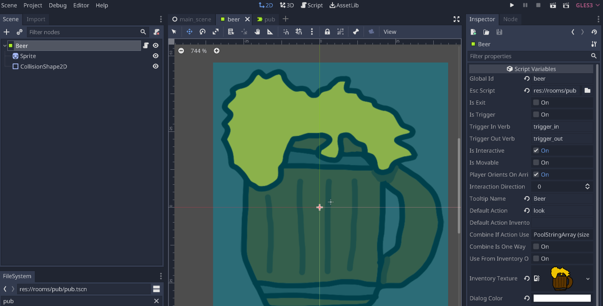
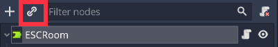
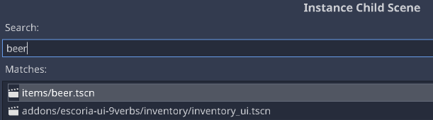
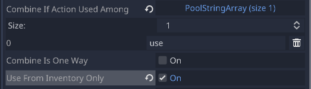

Handling an inventory
=====================

Most adventure games feature inventory puzzles: Things you pick up and combine
with other things which are then used in the game. Classic adventure games
made use of the inventory extensively!

Escoria has features for handling inventory items as well, of course. Let's
embed them into our sample game.

The inventory items path
------------------------

Inventory items are movable. They don't (usually) stay in just one specific
room. This poses a problem for Escoria, because when rooms are changed,
the previous room is removed from Godot's scene tree, together with the items
in there.

To work around this, inventory items must be placed in a special path where
Escoria can find them whenever needed. This path is called the "inventory
items path", and in the game template it defaults to "items".

.. hint::

    You can change it to point somewhere else in
    :doc:`Escoria's settings <../z_escoria_settings>`

Creating an inventory item
--------------------------

Inventory items are also simple ``ESCItem`` instances that you know from the
previous chapter.

Start by copying over the ``mug.png`` file to the "items" directory.

Then, create a new scene and select ``ESCItem`` as its root node. Rename it
to "Beer" and set "beer" as its ``global id``.

Add a ``Sprite`` node with the mug picture. Also, add a
``CollisionShape2D`` node to define the area of interactivity like before.

Finally, create a new ESC script called "beer.esc" and place it in the "items"
folder as well. Leave the script empty for now.

Copy the path to the script and put it in the ``ESC script`` parameter.

.. hint::

    The parameter ``Inventory texture`` will automatically be set to the
    texture set in the ``Sprite`` node. If you want the item to look
    different when it's in the inventory, you can simply change this
    parameter to a different texture.

Save the scene as "beer.tscn" in the items folder.

Using the item in the room
--------------------------

To use this new item in the pub scene, we can use Godot's "instantiate scene"
feature.

Select the ``ESCRoom`` node and click on the "instantiate scene"
button:

Then select the beer item scene.

Now you can place the mug in the scene.

Picking up the mug
------------------

To let Graham pick up the mug, we'll have to create a new event in our
ESC script called ``pickup``, because that is the verb we'll be using.

To add a new item to the inventory, the command ``inventory_add`` is used.

It expects the global id of the item to add as its only parameter.

Additionally, we need to hide the mug from the scene. We can use the command
``set_active`` for that. Inactive items are not visible in a scene.

To put it all together, this is the code you should add to the ESC file:

.. code-block::

    :pickup

    inventory_add beer
    set_active beer false

Try it out. Graham should now be able to pick up the mug!

Using the mug
-------------

Usually, items are not only picked up but also used with different items
either in the inventory or in a particular room.

This is also done using events in the ESC script. Apart from the event name
":use", the target object is also specified.

Let's have Graham react to using the mug with the blackboard. For this, we
need to make the beer combinable with other items when it is used from the
inventory and then react to it in the ESC script of the blackboard.

So go into the beer item scene again and select the property, ``Use from
inventory only``. Now, if you wish to use the verb 'use' with the beer, this
interaction will only be permitted if the beer is in the inventory.

Add an item to the list in the setting ``Combine When Selected Action Is In``
and set it to "use". This enables the player to use another object together
with the mug when using the verb "use".

Save the scene and add the following code to the "blackboard.esc" file:

.. code-block::

    :use beer

    say graham "Why should I throw it at the blackboard? I'm not angry!"

Try it out!

Add in some game logic
----------------------

Let's make the game a little more interesting by adding some logic to change
how the game reacts to events. From your previous lesson, the
"blackboard.esc" file should contain the following.

.. code-block::

    :look
    say graham "That's good to hear. I'm thirsty."

Let's now change how Graham responds based on whether he's picked up the drink.
To do this, we need a condition statement where we look at whether
something is in a particular state and act accordingly.

To use a condition, place a ">" at the start of the line of code. This is
followed by the condition you wish to check inside square brackets.
The state of boolean (true/false) conditions can be reversed with the use of
the "!" (not) symbol. Examples of conditional checks are :

* "> [i/beer]" : is the "beer" in your "i"nventory
* "> [!i/beer]" : is the "beer" NOT in your "i"nventory
* "> [total_coins gt 5]" : Is the value of the "total_coins" global flag
  greater than "5"?

Modify your
"blackboard.esc" to the following :

.. code-block::

    :look
    # If I've picked up the beer
    > [i/beer]
        say graham "I don't need a cocktail, I've got a beer."

    # If I haven't picked up the beer
    > [!i/beer]
        say graham "The cocktails might be free, but I feel like a beer."

Run the game again. Try "looking" at the blackboard both before and after
you've picked up the beer to see how the response changes.

For more information on conditional logic, see
:doc:`https://docs.escoria-framework.org/en/devel/scripting/z_esc_reference.html#conditions`
