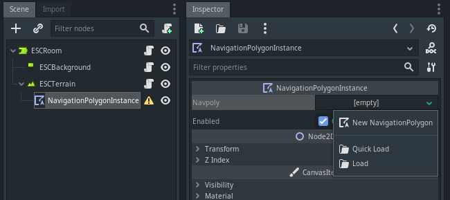
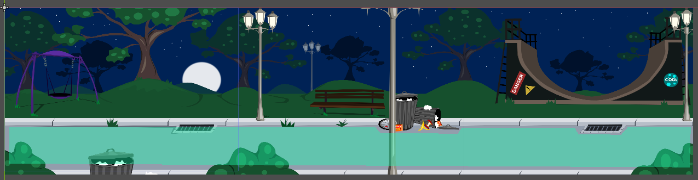
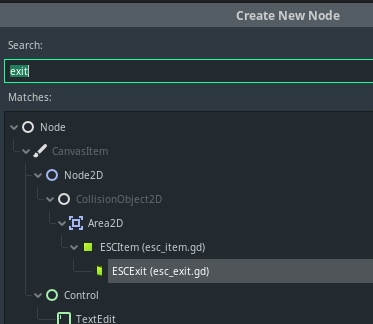
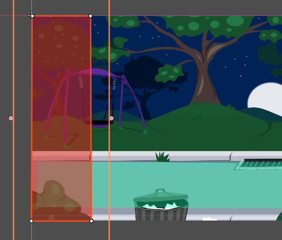
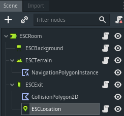
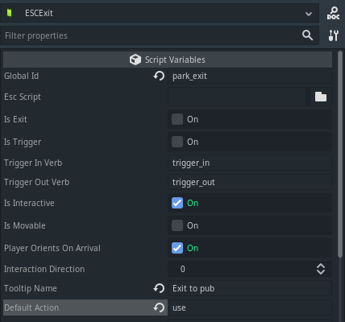
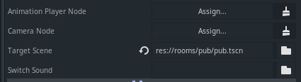
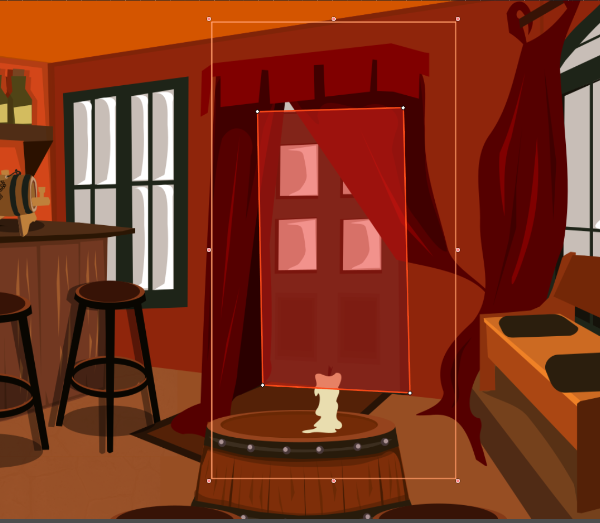
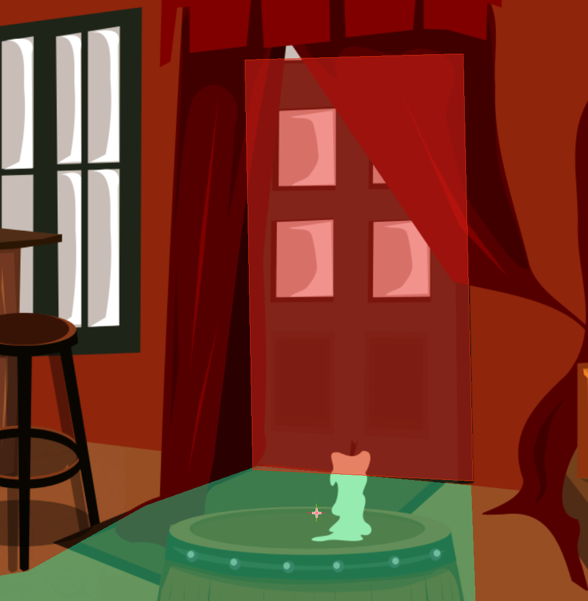
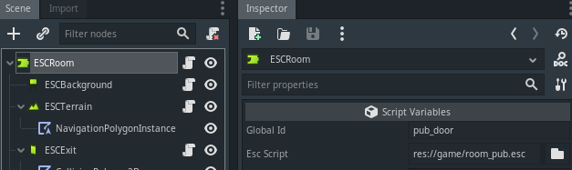

Create a second room
====================
So a one room game is a good start, but your adventure game will be a lot more
interesting when there are other rooms to travel to. Let's create a park scene
and link it to the pub scene so we can walk between them.

As we've already created the first scene, follow the same steps you used on the
:doc:`create a room <3_create_room>` page to create this scene.

* Create a new folder in your rooms folder and call it "park"
* Create a new Godot scene and set ``ESCRoom`` as its root node. Save the scene
  as "park.tscn".
  * Note that you could call the scene something other than "park.tscn" -
  "room2" for example. Make sure you name things in a way that makes sense to
  your game.
* Give the room a global id (``park``)
* We still want to play as Graham in this scene, so select it as the
  ``player scene`` parameter.
* Add an ESCBackground node for the room graphics as a child of the root node.
* From ``backgrounds.zip``, copy the ``park_bg.png`` file to the **rooms**
  directory and set it as the ``texture`` parameter in the ``ESCBackground``
  node.
* Create a walkable area for the character. Add an ``ESCTerrain``
  node to the ``ESCRoom`` node. Add a
  ``NavigationPolygonInstance`` node as a child of the new ``ESCTerrain`` node.
* Create a NavigationPolygonInstance resource for the Navpoly parameter.

* Use the editor window to draw a polygon. This polygon is the area in which
  the character can move around freely.

Creating a light map
--------------------

For this room we're going to use a light map. As mentioned previously, light
maps are used to shade different areas of the room differently. In this room,
we have a lamp, so we want the player to be brightly lit when under it, and
less brightly lit when away from the light source.

The example light map provided is a very simple one with just 3 colours to make
it easier to demonstrate how the light map changes how the game character
looks, but you could replace it with one that uses a gradient to fade nicely
from white to mid-grey. Coloured ones can also be used to simulate things like
concert or traffic lights.

Copy the park_lightmap.png asset (link on the main step-by-step page) to the
"park" folder.

In the Godot GUI, select the ``ESCTerrain`` node, and set its light map to the
`park_lightmap.png` texture.

Room exits in Escoria
---------------------

To link room 2 (the park) to room 1 (the pub), you will need an exit node. When
the player clicks this, it tells Escoria that you want to change rooms. Each
Escoria room can have multiple exits.

There are 2 different nodes for creating exits in Escoria. The first is an
:doc:`ESCItem </api/ESCItem>`. By selecting the "Is Exit" checkbox when you
create an ``ESCItem`` node, Escoria will look for a ":exit_scene" event in the
attached script file. Any commands you place in the ":exit_scene" event will be
run when the player chooses to "use" the exit - for example, saying a goodbye,
or running a cutscene. Place a "change_scene" command as part of this event to
move the character to the next room.

For exits that don't require scripts, the :doc:`ESCExit </api/ESCExit>` node is
provided. The only things you will need to configure on the node are the
``target scene`` to change to, and optionally, a "switch sound" (the sound to
play when changing rooms).

For both ``ESCExit`` and ``ESCItem`` nodes:
* A child ``CollisionPolygon2D`` node is used to define where the player needs
to click to activate the exit.
* When the exit is activated, the character will automatically walk to a
``ESCLocation`` node that is a child of the ``ESCItem`` / ``ESCExit`` node.

.. hint::

   ``ESCExit`` nodes (or ``ESCItem`` nodes with ``Is Exit`` selected) only tell
   Escoria to change rooms. It doesn't tell Escoria where to place the player
   in the new room, or anything else about how to set up the new room. This
   configuration lives in ``setup`` or ``ready`` events which will be explained
   shortly.

Create a doorway back to the pub room
-------------------------------------

* Create an ``ESCExit`` node as a child of the room and give it a "Global ID"

Under the ESCroom node, create an ESCexit node.

Set its Global ID to "exit_to_pub".

* Create a CollisionPolygon2D for the exit

Create a CollisionPolygon2D as a child of the ESCexit. Use the editor window to
draw a rectangle covering the left-hand-edge of the park background. This
polygon is the area which will act like a "door" for the player to click on to
change rooms. (If the room had a doorway, you'd draw the polygon around the
door instead).

* Create an ESCLocation

When the player clicks on the exit's collision polygon, Escoria needs to know
where to make the character walk to in order to leave the room.

Create an ``ESCLocation`` as a child of the ``ESCexit``. Give this location the
``Global ID`` of "park_exit".
Move the ``ESCLocation`` to the left hand side of the park somewhere on the
road/path. This will be where the character walks to to leave the park.

.. hint::

   Make sure the ESClocation is inside the walkable area navigation polygon.

* Set up the tooltip for the exit

When you put the mouse over the exit, you want the tooltip in the UI to tell
you what object your mouse is over. Additionally you want to set the
interaction with this exit that will happen by default to make the experience
better for the player. Under ``Tooltip name`` put "Exit to pub", and under
``Default Action`` put "use".

* Set the destination scene for the exit

Further down in the ESCExit's settings, select the ``Target scene``. Clicking
this will take you to a file explorer where you can choose the room you want
the character to be sent to when the player clicks on this exit. Locate the
pub scene and select that. (If you had a noise to play like a door closing when
the player used this exit, you would use the "Switch sound" parameter to set
it).

Set up a doorway in the pub room
--------------------------------
If you played the game now, you'd find it was a bit broken. The game would
start in the pub room, but you'd have no way to leave it to get to the park.
If you were somehow able to get to the park and tried to get back, the game
wouldn't know where in the pub to place your character.

Lets fix this by creating a doorway in the pub and make it so that using it
takes you to the park, and clicking on the edge of the park brings you back to
the pub's doorway.

The process here will be the same process we followed in the park.

Load your pub.tscn scene in the Godot editor.

Create an ESCexit as a child of the ESCRoom. Give it a Global ID of
"pub_door". Set its ``Target scene`` to park.tscn. This will send the player to
the park when they click the door.

Create a CollisionPolygon2D as a child of the ESCExit. Draw the
polygon around the doorway. This defines where you can click to
activate the exit to leave the pub and go to the park.

When you created the pub room you set an ESClocation for the characters
starting point (e.g. at the bottom of the stairs). If the player comes back
into the pub from the park scene, they should be at the doorway rather than
appear at the bottom of the stairs. We therefore need an ``ESCLocation`` at the
doorway that we can send them to.

Create a new ESClocation as a child of the pub's ESCExit. Set its
``Global ID`` to "pub_exit". This will be where the user appears
when they come into the pub from the park. Place its marker
just under the doorway. This wil also be where the character walks to
when you click the door to leave the pub.

.. hint::

   Make sure the ESClocation is inside the walkable area polygon.

Configure the change between rooms
----------------------------------

What we now need is to tell Escoria to move the character to the correct
location when they change between rooms. For this we will use a script that
will run when the room first loads. It will check which room the player has
come from and immediately send them to the correct ``ESCLocation``.

Setup and Ready events
^^^^^^^^^^^^^^^^^^^^^^

To finish the switch between rooms, we need to explain how the room change
works. When you activate an ``ESCExit`` (or ``ESCItem`` with "is exit"
selected), you use the ``change_scene`` command to tell Escoria to replace the
current room with new room. It doesn't tell the Escoria anything about how to
set up the new room or where to put the player - this is the responsibility
of the new room.

Each room's root node is an ``ESCRoom`` node, and the script attached to this
(if there is one) is responsible for setting up anything dynamic in the room.
When ``change_scene`` loads the room, it will look in the new room's script for
a ``setup`` event. Any commands you put in this script will run before the
player sees the new room - use this to reset any movable objects to their start
positions.

After the ``setup`` event completes, a transition will run (there is a default
one set in the Escoria configuration settings), but typically the transition
will be some sort of nice fade-in effect to show the room. Once the transition
in runs, Escoria will run any commands in the ``ready`` event. Place any
commands in here that will tell the next part of your game's story (e.g. make
the player walk to the window and comment on how it looks like a storm is
approaching.)

.. hint::

   If you do not have a script attached to your ``ESCRoom`` the player will
   automatically be placed at a start location called ``player_start`` if you
   have created an ``ESCLocation`` with this name as part of the room.
   If an ``ESCLocation`` with this name does not exist, the player will start
   as close to coordinate (0,0) as possible.

.. hint::

   There can only be one of each type of event per script. If you want multiple
   steps to run as part of an event (the ``ready`` event for example), place
   all the commands within the one event block.

.. hint::

   Transitions are run by default as part of the ``change_scene``
   command, but this can be manually overridden if desired.

For more detail on the order of events in Escoria, see :
https://docs.escoria-framework.org/en/devel/advanced/escoria_architecture.html#game-start-sequence

Setting the character's start position in each room
^^^^^^^^^^^^^^^^^^^^^^^^^^^^^^^^^^^^^^^^^^^^^^^^^^^
Create a new ESC script "room_pub.esc" and attach it as
the ``ESC script`` on the pub room's ``ESCRoom`` node. This is the script the
room will open when it starts.

Add the following code to room_pub.esc

.. code-block::

   :setup
    > [eq ESC_LAST_SCENE park]
       teleport graham pub_exit
       # Set player look left
       set_angle graham 180

This code says
1) Run these steps when setting up the room
2) Check (">") if the ``global_id`` of the last room you were in (ESC_LAST_SCENE) was (eq) "park"
3) If so, `teleport` the object "graham" to the ``ESClocation`` called
"pub_exit"
4) Finally make the player face left

.. hint::

   If the last scene wasn't the "park" scene, the condition check will not be
   true, so the code ("teleport" and "set_angle") will not execute.
   If you don't have any other code to tell Escoria where to place the player,
   they will be placed at the "player_start" ``ESCLocation`` or coordinate
   (0,0) as described above.

Now follow the same process to create an ESC script called "room_park.esc".
Load the park scene and configure "room_park.esc" as the ``ESC script`` on the
park room's ``ESCRoom`` node. This is the script the park room will open when
it starts.

Add the following code to room_park.esc

.. code-block::

   :setup
    > [eq ESC_LAST_SCENE pub]
       teleport graham park_exit
       # Set player look right
       set_angle graham 90

Test the scene. You should now be able to click on the door to leave the pub -
you will appear in the park. If you click on the left hand side of the park
you will appear in the doorway of the pub.

Additionally, due to the light map configured for the park scene, you should be
in shadows when you walk in the park, and get lighter when you walk under the
light.

.. hint::

   To stop any further commands from running in a script as part of any event
   (at the end of an ">" conditional statement for example), add a "stop"
   command. All following commands will be run until either a `stop` command or
   the configuration for a different event is encountered.

Creating an exit using an ESCItem instead of an ESCExit
-------------------------------------------------------
As mentioned earlier, for more complex exit sequences, an ``ESCItem`` is used
rather than an ``ESCExit``.

If you wanted to create the pub door using an ``ESCItem`` you would:
* Create an ``ESCItem`` as a child of the ``ESCRoom``. Give it a Global ID of
"pub_door_item".
* Create a new ESC script file
and call it "pub_exit.esc". Where you place this file is up to you and how
it makes sense with your project. You might choose to store it with the
room, or keep all your game's scripts together in a "scripts" folder.
* In pub_exit.esc, add an ``:exit_scene`` event to our ESC file and within it,
use the ``change_scene`` command to make the game switch from this pub room to
the park room when the player "uses" the exit. You would add any other
animation / dialog / etc to this script that you want to be played when
the player activates the exit. e.g.

.. code-block::

    :exit_scene
    say graham "I'm leaving now."
    change_scene "res://rooms/park/park.tscn"

* Change the "Esc Script" of the ESCItem to point to your script so Escoria
  runs the code you've just written when the user exits the scene using this
  node.

