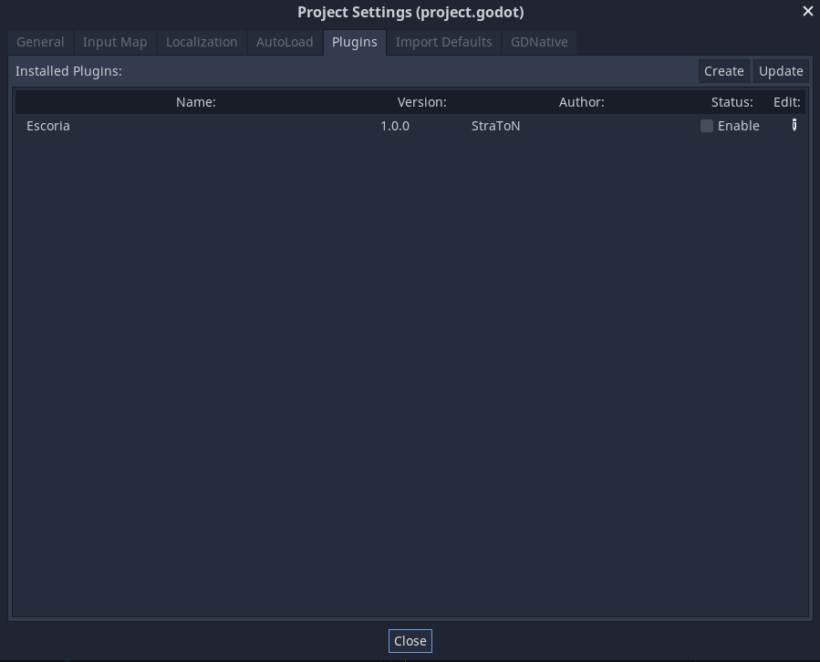

.. create_escoria_project

Create an Escoria project
=========================

You can create a project in 2 ways using Godot Engine's project manager: you can either use a template directly from Godot's Asset Library, or use an archive containing the whole Escoria plugin to decompress into you project folder.

From Godot Engine's Asset Library
---------------------------------

.. 
    _TODO

To be written, as Escoria is not available on Asset Lib at the time of writing.

From a downloaded archive
-------------------------

You may download the `latest released Escoria archive <https://github.com/godot-escoria/escoria-core/releases>`_ on Github. If you wish so, you can use the development version of Escoria by downloading the `current state of the main branch <https://github.com/godot-escoria/escoria-core/archive/refs/heads/main.zip>`_ or cloning it into your Godot project using *git*:

.. code-block::

    git clone

At this point you should have an ``addons/`` folder into your main project folder.

Enable Escoria plugin
---------------------

You may now see a new entry in your project settings:

Tick the "Enable" checkbox on Escoria addon line, and click the "Update" button on top of the window and Close the window.

Escoria is now enabled in your project. Do no mind the parameters now available in the General tab of Project Settings (section "Escoria"), as we'll edit them progressively.

